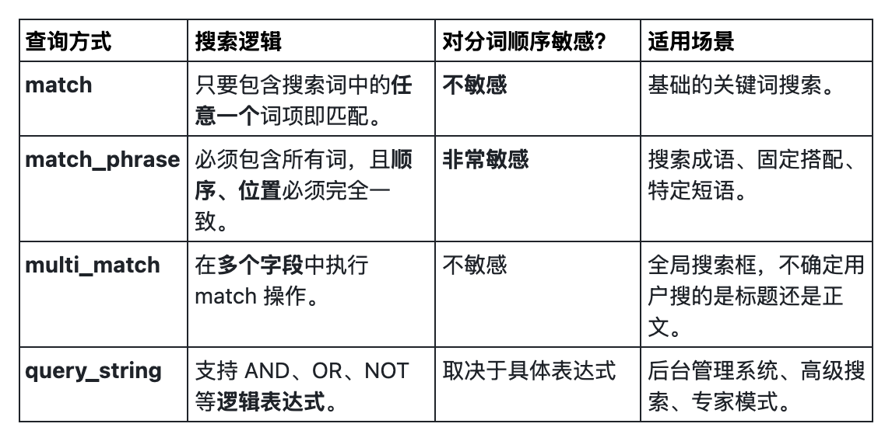

## 构建环境
```json
PUT /news_index
{
  "mappings": {
    "properties": {
      "title": {
        "type": "text",
        "analyzer": "standard"  // 显式指定标准分词器
      },
      "author": {
        "type": "keyword"       // 不分词，用于精确匹配
      },
      "content": {
        "type": "text",
        "analyzer": "standard"
      }
    }
  }
}


POST /news_index/_bulk
{ "index": { "_id": "1" } }
{ "title": "Learning Python is Fun", "content": "Python is a versatile programming language.", "author": "Alice" }
{ "index": { "_id": "2" } }
{ "title": "Python Learning for Beginners", "content": "Start your journey with Python basics.", "author": "Bob" }
{ "index": { "_id": "3" } }
{ "title": "Advanced Java Programming", "content": "Mastering Java for professional developers.", "author": "Alice" }
```
## match
### 查询
```json
GET /news_index/_search
{
  "query": {
    "match": {
      "title": "Learning Python"
    }
  }
}
```
### 结果
```json
{
  "took": 0,
  "timed_out": false,
  "_shards": {
    "total": 1,
    "successful": 1,
    "skipped": 0,
    "failed": 0
  },
  "hits": {
    "total": {
      "value": 2,
      "relation": "eq"
    },
    "max_score": 0.90630186,
    "hits": [
      {
        "_index": "news_index",
        "_id": "1",
        "_score": 0.90630186,
        "_source": {
          "title": "Learning Python is Fun",
          "content": "Python is a versatile programming language.",
          "author": "Alice"
        }
      },
      {
        "_index": "news_index",
        "_id": "2",
        "_score": 0.90630186,
        "_source": {
          "title": "Python Learning for Beginners",
          "content": "Start your journey with Python basics.",
          "author": "Bob"
        }
      }
    ]
  }
}
```
### 分析
match 会把搜索词拆成 learning 和 python。只要标题里有其中一个词就会被搜出来。ID 1 和 ID 2 都包含这两个词，所以都会出现。
## match_phrase 
### 查询
```json
GET /news_index/_search
{
  "query": {
    "match_phrase": {
      "title": "Learning Python"
    }
  }
}
```
### 结果
```json
{
  "took": 135,
  "timed_out": false,
  "_shards": {
    "total": 1,
    "successful": 1,
    "skipped": 0,
    "failed": 0
  },
  "hits": {
    "total": {
      "value": 1,
      "relation": "eq"
    },
    "max_score": 0.90630186,
    "hits": [
      {
        "_index": "news_index",
        "_id": "1",
        "_score": 0.90630186,
        "_source": {
          "title": "Learning Python is Fun",
          "content": "Python is a versatile programming language.",
          "author": "Alice"
        }
      }
    ]
  }
}
```
### 分析
它要求 learning 和 python 必须相邻且顺序一致。ID 2 的标题是 "Python Learning"，顺序反了，所以不匹配。
## multi_match
### 查询
```json
GET /news_index/_search
{
  "query": {
    "multi_match": {
      "query": "Java",
      "fields": ["title", "content"]
    }
  }
}
```
### 结果
```json
{
  "took": 15,
  "timed_out": false,
  "_shards": {
    "total": 1,
    "successful": 1,
    "skipped": 0,
    "failed": 0
  },
  "hits": {
    "total": {
      "value": 1,
      "relation": "eq"
    },
    "max_score": 1.0596458,
    "hits": [
      {
        "_index": "news_index",
        "_id": "3",
        "_score": 1.0596458,
        "_source": {
          "title": "Advanced Java Programming",
          "content": "Mastering Java for professional developers.",
          "author": "Alice"
        }
      }
    ]
  }
}
```
### 分析
它会同时在 title 和 content 两个字段里找 "Java"。如果其中任何一个字段匹配，文档就会被召回。适合那种“全文搜索框”的场景。
## query_string
### 查询
```json
GET /news_index/_search
{
  "query": {
    "query_string": {
      "query": "Python AND (Fun OR Basics)",
      "default_field": "title"
    }
  }
}
```
### 结果
```json
{
  "took": 0,
  "timed_out": false,
  "_shards": {
    "total": 1,
    "successful": 1,
    "skipped": 0,
    "failed": 0
  },
  "hits": {
    "total": {
      "value": 1,
      "relation": "eq"
    },
    "max_score": 1.3988109,
    "hits": [
      {
        "_index": "news_index",
        "_id": "1",
        "_score": 1.3988109,
        "_source": {
          "title": "Learning Python is Fun",
          "content": "Python is a versatile programming language.",
          "author": "Alice"
        }
      }
    ]
  }
}
```
### 分析
它支持复杂的逻辑运算符。ID 1 标题里有 Python 且有 Fun；ID 2 标题里虽然有 Python 但没有 Fun（Basics 在 content 里而不在 title 里，所以 ID 2 没中）。
## 对比

