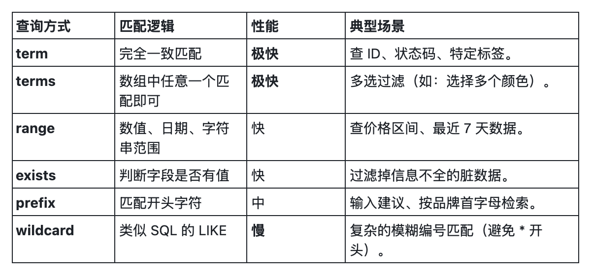

## 环境准备
```json
PUT /products_precise
{
  "mappings": {
    "properties": {
      "product_code": { "type": "keyword" }, // 精确匹配
      "category": { "type": "keyword" },     // 分类
      "price": { "type": "integer" },        // 数字
      "tags": { "type": "keyword" },         // 数组标签
      "release_date": { "type": "date" },    // 日期
      "description": { "type": "text" }      // 仅用于对比 exists
    }
  }
}

POST /products_precise/_bulk
{ "index": { "_id": "1" } }
{ "product_code": "AAPL-001", "category": "Phone", "price": 5999, "tags": ["Apple", "New"], "release_date": "2023-09-01", "description": "High-end smartphone" }
{ "index": { "_id": "2" } }
{ "product_code": "HW-002", "category": "Phone", "price": 4999, "tags": ["Huawei", "5G"], "release_date": "2023-10-15" }
{ "index": { "_id": "3" } }
{ "product_code": "SAM-003", "category": "Tablet", "price": 2999, "tags": ["Samsung"], "release_date": "2022-05-20" }
```
## term
### 查询
```json
GET /products_precise/_search
{
  "query": {
    "term": { "product_code": "AAPL-001" }
  }
}
```
### 结果
```json
{
  "took": 0,
  "timed_out": false,
  "_shards": {
    "total": 1,
    "successful": 1,
    "skipped": 0,
    "failed": 0
  },
  "hits": {
    "total": {
      "value": 1,
      "relation": "eq"
    },
    "max_score": 0.9808291,
    "hits": [
      {
        "_index": "products_precise",
        "_id": "1",
        "_score": 0.9808291,
        "_source": {
          "product_code": "AAPL-001",
          "category": "Phone",
          "price": 5999,
          "tags": [
            "Apple",
            "New"
          ],
          "release_date": "2023-09-01",
          "description": "High-end smartphone"
        }
      }
    ]
  }
}
```
### 分析
查找 product_code 完全等于 "AAPL-001" 的文档。
## terms
### 查询
```json
GET /products_precise/_search
{
  "query": {
    "terms": { "category": ["Phone", "Tablet"] }
  }
}
```
### 结果
```json
{
  "took": 1,
  "timed_out": false,
  "_shards": {
    "total": 1,
    "successful": 1,
    "skipped": 0,
    "failed": 0
  },
  "hits": {
    "total": {
      "value": 3,
      "relation": "eq"
    },
    "max_score": 1,
    "hits": [
      {
        "_index": "products_precise",
        "_id": "1",
        "_score": 1,
        "_source": {
          "product_code": "AAPL-001",
          "category": "Phone",
          "price": 5999,
          "tags": [
            "Apple",
            "New"
          ],
          "release_date": "2023-09-01",
          "description": "High-end smartphone"
        }
      },
      {
        "_index": "products_precise",
        "_id": "2",
        "_score": 1,
        "_source": {
          "product_code": "HW-002",
          "category": "Phone",
          "price": 4999,
          "tags": [
            "Huawei",
            "5G"
          ],
          "release_date": "2023-10-15"
        }
      },
      {
        "_index": "products_precise",
        "_id": "3",
        "_score": 1,
        "_source": {
          "product_code": "SAM-003",
          "category": "Tablet",
          "price": 2999,
          "tags": [
            "Samsung"
          ],
          "release_date": "2022-05-20"
        }
      }
    ]
  }
}
```
### 分析
查找 category 为 "Phone" 或者 "Tablet" 的文档（类似 SQL 的 IN）。
## range
### 查询
```json
GET /products_precise/_search
{
  "query": {
    "range": {
      "price": {
        "gte": 3000, // 大于等于
        "lte": 6000  // 小于等于
      }
    }
  }
}
```
### 结果
```json
{
  "took": 0,
  "timed_out": false,
  "_shards": {
    "total": 1,
    "successful": 1,
    "skipped": 0,
    "failed": 0
  },
  "hits": {
    "total": {
      "value": 2,
      "relation": "eq"
    },
    "max_score": 1,
    "hits": [
      {
        "_index": "products_precise",
        "_id": "1",
        "_score": 1,
        "_source": {
          "product_code": "AAPL-001",
          "category": "Phone",
          "price": 5999,
          "tags": [
            "Apple",
            "New"
          ],
          "release_date": "2023-09-01",
          "description": "High-end smartphone"
        }
      },
      {
        "_index": "products_precise",
        "_id": "2",
        "_score": 1,
        "_source": {
          "product_code": "HW-002",
          "category": "Phone",
          "price": 4999,
          "tags": [
            "Huawei",
            "5G"
          ],
          "release_date": "2023-10-15"
        }
      }
    ]
  }
}
```
### 分析
查找价格在 3000 到 6000 之间的产品。
## exists
### 查询
```json
GET /products_precise/_search
{
  "query": {
    "exists": { "field": "description" }
  }
}
```
### 结果
```json
{
  "took": 0,
  "timed_out": false,
  "_shards": {
    "total": 1,
    "successful": 1,
    "skipped": 0,
    "failed": 0
  },
  "hits": {
    "total": {
      "value": 1,
      "relation": "eq"
    },
    "max_score": 1,
    "hits": [
      {
        "_index": "products_precise",
        "_id": "1",
        "_score": 1,
        "_source": {
          "product_code": "AAPL-001",
          "category": "Phone",
          "price": 5999,
          "tags": [
            "Apple",
            "New"
          ],
          "release_date": "2023-09-01",
          "description": "High-end smartphone"
        }
      }
    ]
  }
}
```
### 分析
查找包含 description 字段且值不为 null 的文档（ID 2 和 3 没有这个字段）。
## prefix
### 查询
```json
GET /products_precise/_search
{
  "query": {
    "prefix": { "product_code": "HW" }
  }
}
```
### 结果
```json
{
  "took": 0,
  "timed_out": false,
  "_shards": {
    "total": 1,
    "successful": 1,
    "skipped": 0,
    "failed": 0
  },
  "hits": {
    "total": {
      "value": 1,
      "relation": "eq"
    },
    "max_score": 1,
    "hits": [
      {
        "_index": "products_precise",
        "_id": "2",
        "_score": 1,
        "_source": {
          "product_code": "HW-002",
          "category": "Phone",
          "price": 4999,
          "tags": [
            "Huawei",
            "5G"
          ],
          "release_date": "2023-10-15"
        }
      }
    ]
  }
}
```
### 分析
查找 product_code 以 "HW" 开头的文档。
## wildcard
### 查询
```json
GET /products_precise/_search
{
  "query": {
    "wildcard": { "product_code": "SAM-*" }
  }
}
```
### 结果
```json
{
  "took": 0,
  "timed_out": false,
  "_shards": {
    "total": 1,
    "successful": 1,
    "skipped": 0,
    "failed": 0
  },
  "hits": {
    "total": {
      "value": 1,
      "relation": "eq"
    },
    "max_score": 1,
    "hits": [
      {
        "_index": "products_precise",
        "_id": "3",
        "_score": 1,
        "_source": {
          "product_code": "SAM-003",
          "category": "Tablet",
          "price": 2999,
          "tags": [
            "Samsung"
          ],
          "release_date": "2022-05-20"
        }
      }
    ]
  }
}
```
### 分析
查找符合特定模式的编码。? 代表单个字符，* 代表零个或多个字符。
## 对比

