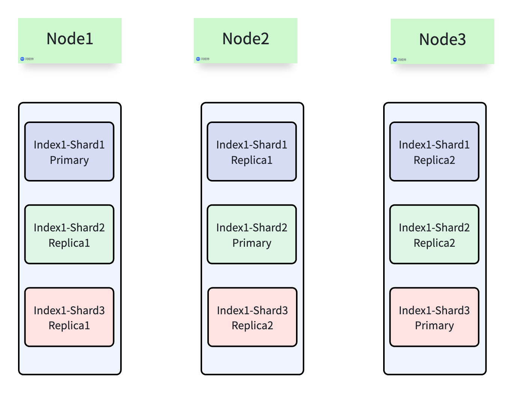
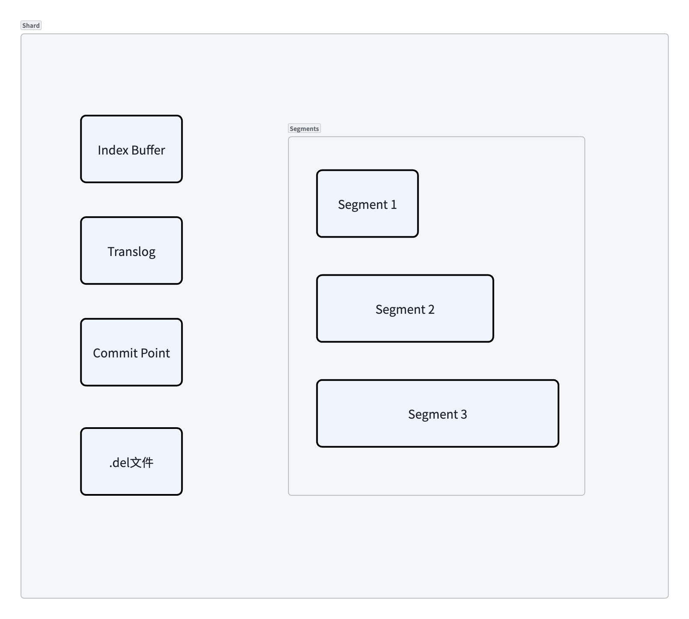
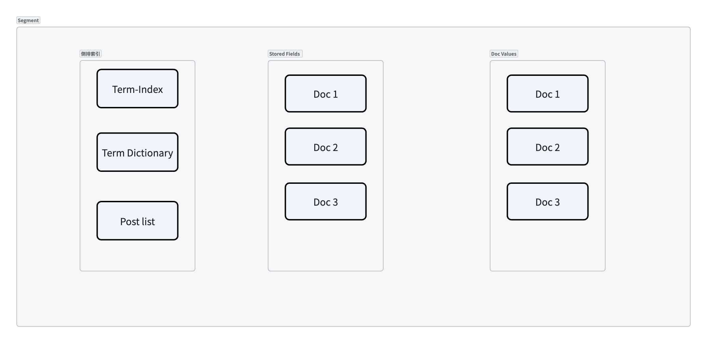
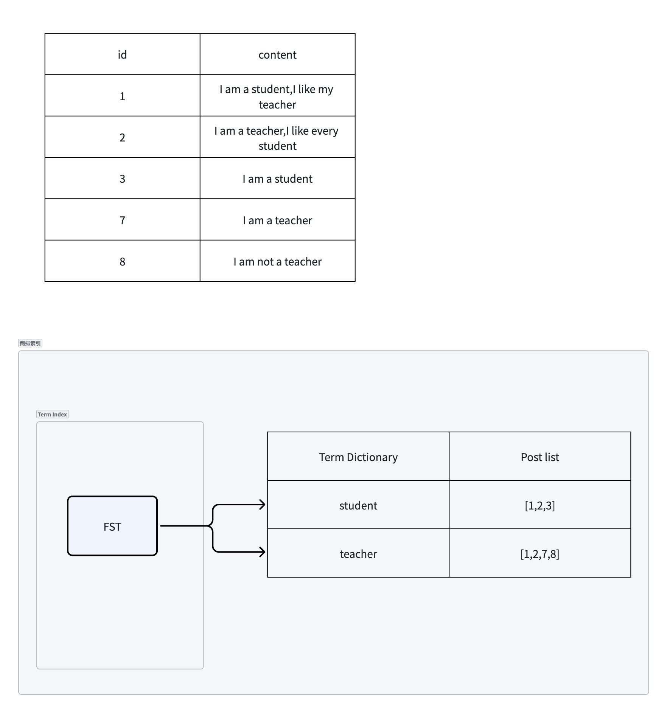

## Node-Index-Shard
- 一个集群有多个Node组成,每个Index分成多个Shard存储,每个主分片可以有多个副本分片。
- 写入时主分片负责接收被协调节点路由此分片的请求并写入数据,随后并发将写入请求发送到所有ISR副本分片,等待副本分片写入成功后向协调节点返回成功
- 查询时同一分片的主副分片都可以接受协调节点发来的查询请求,协调节点会把请求发送到所有分片(可以是主或者副本),每个分片各自计算得分返回TopK文档的ID和得分,然后协调节点排序后取TopK个文档的ID再向分片发送GET请求获取文档完整信息

>   number_of_shards=3
>
>   number_of_replicas=2
>
>   总分片数= number_of_shards*(number_of_replicas+1) 

## Shard-Segment
- 每个Shard就是一个完整的 Lucene 索引实例

- IndexBuffer是写入的第一站,文档写入时先写内存缓冲区,该区域的文档还不能被搜索

- refresh之后,缓冲区的内容会被刷入新的Segment,此时数据才变得可见

- 每个Shard内部有多个Segment,refresh时将IndexBuffer中的数据写入新Segment并写入文件系统缓存,触发flush时或OS触发刷盘时会将文件系统缓存中的Segment数据强制写入磁盘,一旦写入磁盘就不可被修改,删除操作只是在.del标记,直到段合并才真正物理删除

- Translog记录每一次写操作,和IndexBuffer是一个并发的原子操作,Translog大小达到阈值或者配置的刷盘间隔到了会将内存中的数据刷入磁盘并清空Translog的数据,节点宕机可以通过重放Translog来回复未被写入到Segment中的数据

- 检查点记录所有活跃副本已完成的操作的最大序号

- 索引引擎负责决策什么时候写Translog什么时候让Lucene执行refresh或者flush

## Segment内部结构

### 倒排索引 
倒排索引(Inverted Index)
- Term Dictionary(词典):文档中出现的所有去重后的词条(Term),同产按字母顺序排序,为了加快查找,它配合内存中的Term Index 快速定位词条在磁盘上的位置
- Postings List(倒排列表): 每个词条对应一个列表,记录了哪些文档包含该词也就是文档ID,出现的频率(TF)以及出现的位置(用于短语搜索),会使用Delta Encoding（增量编码）压缩文档ID列表
- TermIndex: 用于快速通过条件找到词典中的词条,用FST(有限状态转换机)存储,通常需要加载到内存中

### 正排索引
正排索引(Doc Values)
- 采用列式存储,相同字段去重排序后存在连续地址空间,且记录DocId到字段空间编号,可快速通过DocId找到字段值。
- 需要聚合或排序时,ES可以直接从Doc Values中按ID取值,由于是连续存储所以对CPU缓存友好
### 行式索引
- Stored Fields: 以行式存储记录原始字段,能通过ID快速取出整行数据
- ES中会将整个文档的JSON作为一个特殊Stored Fields,在_source字段返回

