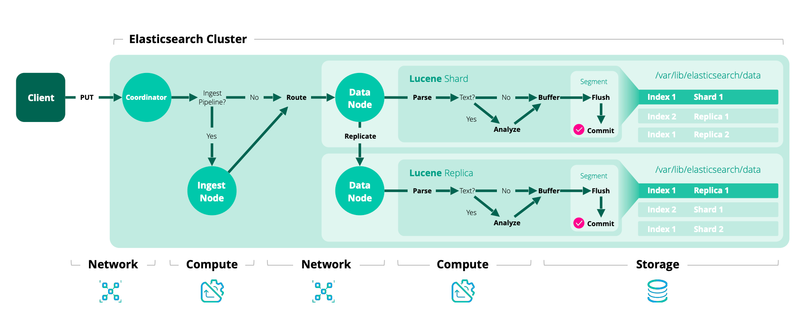

## 写入
### 协调阶段
协调节点负责接收请求并决定数据的去向。
- 客户端将写请求发送到集群中的任意节点，该节点即成为协调节点。
- 协调节点计算出文档主分片编号
    - shard = hash(_routing) % number_of_primary_shards
- 检查集群状态,如果当前活跃的分片数（Active Shards）少于配置的要求（wait_for_active_shards默认 1，可调），协调节点直接拒绝请求，返回错误
- 预检通过后,协调节点将写请求转发到对应主分片
### Primary 阶段
主分片节点负责执行写入操作并维护数据一致性。
- 本地写入Memory Buffer和Translog
- 主分片写入成功后会将请求并行转发给所有处于ISR集合中的副本分片
### Replica 阶段
副本分片负责冗余存储,确保高可用.
- 每个副本节点接收到主分片的请求后，执行与主分片类似的写入逻辑（写入 Memory Buffer 和 Translog
- 副本分片处理完成后，向主分片发送“已完成”的回执
- 主分片收到足够数量(wait_for_active_shards-1)的副本确认就会向协调节点报告成功
- 协调节点将结果返回给客户端
## 查询
### 查询阶段
这个阶段的目标是：找出哪些文档匹配查询条件,并且获取每个Shard前TopN个复合条件的结果的排序字段和ID值
- 客户端发送查询请求到任意节点,该节点就成为协调节点
- 协调节点通过负载均衡算法,从index的每个分片的主分片或副本分片中选取一个进行转发
- 每个接收到请求的分片在本地查询
- 计算相关性得分后根据排序规则筛选出TopN个文档
- 分片向协调节点返回文档的ID和Score(或排序字段)
### Fetch阶段
这个阶段的目标是：对每个Shard的结果进行全局排序取出TopN个结果的排序字段和ID值,通过ID再去对应节点获取完整文档最终返回TopN个完整文档给客户端
- 协调节点对所有分片返回的ID和Score(或排序字段),进行全局二次排序,筛选出前TopN个
- 协调节点通过TopN个结果的ID向对应的分片发送GET请求
- 各个分片根据ID返回向协调节点完整文档,如果有高亮等需求也在这一步完成
- 协调节点组装最终结果,返回给客户端TopN条完整文档