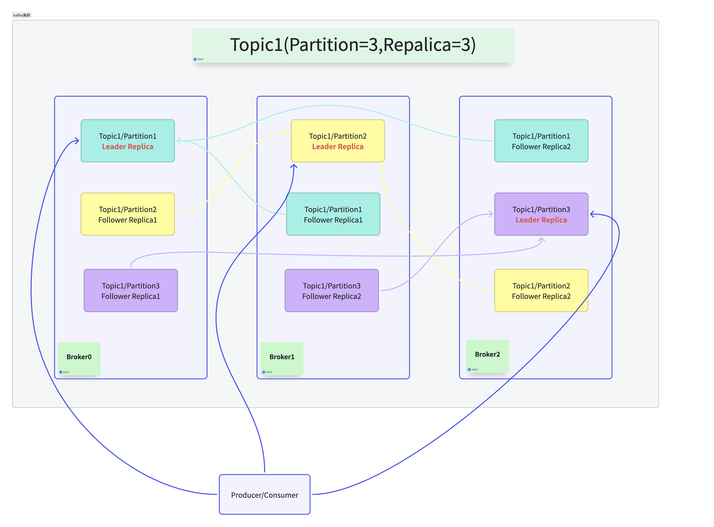
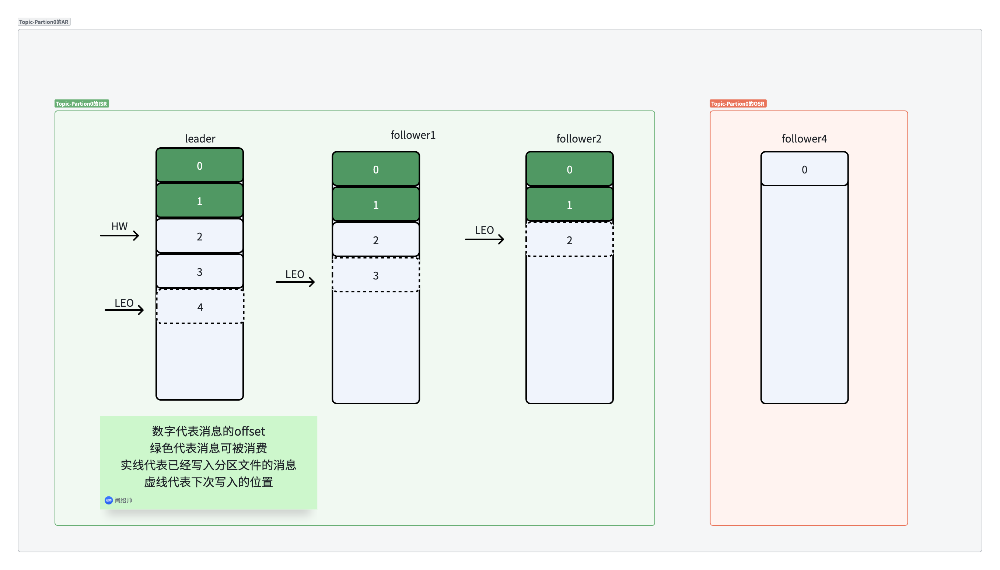
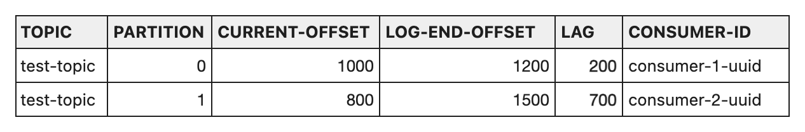

## 架构



### Broker
Broker是一个Kafka实例,一个Kafka集群油多个Broker组成

### Topic
Topic是消息的分类单元,一个Topic会被分成多个Partition存储

### Partion
Partition是Topic的数据分片,一个分区内消息按顺序存储,分区是Kafka并发处理的最小单位

### Replica
为了保证高可用性,每个Partition都会有多个副本
- Leader副本: 负责所有的读写请求
- Follower 副本: 只负责从Leader同步数据,如果Leader宕机,其中一个Follower会被选举为新Leader

### Producer
负责发布消息到Kafka到Topic

### Consumer
订阅Topic并处理消息
- 消费者组: 消费者组内有多个消费者,他们共同消费Topic的不同分区,一个分区只能被消费者组内的一个消费者消费,组内的一个消费者可以消费多个分区

## 多副本机制

### AR
Topic中某个数据分片的所有分区,叫作AR(Assigned Replicas)
- AR = ISR + OSR

### ISR
所有与Leader副本保持一定程度同步的副本(包括Leader)构成ISR(In-Sync Replicas)

### OSR
与Leader副本同步滞后过多的副本组成OSR(Out-Of-Sync Replicas)

### Offset
分区中消息的偏移量,是消息在分区中的唯一标识

### LEO
分区文件最后一条消息的Offset+1,指向下一条消息将要写入的位置

### HW
高水位,同一分区的所有副本的最小LEO,只有HW之前的数据可以被消费(图中0-1可以被消费)

### 副本Leader选举
Controller 会从 AR 列表中从前往后找到第一个在 ISR 集合中的副本作为新 Leader。



## 重复消费

### 产生原因
- 消费者处理完了消息,但在提交Offset完成之前挂了,Reblance后,新的消费者会从上一次提交的Offset处开始读消息,导致这部分消息被重复处理

### 解决方案

- 关闭自动提交Offset,在业务逻辑完成后手动提交Offset,并利用数据库唯一索引或者Redis的SetNx保证幂等
- 将业务操作和Offset提交放在同一事务中，Offset提交完了再提交事务

## 消息不丢失

- 生产端,设置acks=all,保证发送消息时Leader必须等到所有ISR中的副本都同步成功再返回确认
- Broker端
   - replication.factor >= 3（副本数至少为 3）。

    - min.insync.replicas > 1（保证 ISR 中至少有两个副本，否则 Producer 写入失败,如果设置为1 只有Leader存活的情况下也允许写入,此时没有备份副本）
- 消费端关闭自动提交,业务处理成功后再手动提交Offset

## 顺序消息

### 分区内有序
Kafka Topic存在多分区的情况下只能保证Partition内的消息有序
- 发送消息时指定Key,Kafka会根据key的Hash值将消息路由到同一个Partition
- 如果分区数变动,Key路由到的分区会变,顺序会乱

### 全局有序
Kafka只能保证分区内有序,如果要保证全局有序,只能将Topic的分区设置成一个,会降低Kafka的并发性能

## 消息积压

### 发现
Lag = LEO（分区最新位移）- Current Offset（消费者当前位移）,Lag越大消费积压越严重
通过以下命令行可以查看消费者组的消费情况和Lag值
```shell
# 替换 <broker_list> 为你的 IP:Port, <group_name> 为你的消费者组 ID
bin/kafka-consumer-groups.sh --bootstrap-server <broker_list> --describe --group <group_name>
```
结果


CURRENT-OFFSET: 消费者最后一次提交的位移。

LOG-END-OFFSET (LEO): Broker 端该分区最后一条消息的位移。

LAG: 重点关注项。如果数值持续增长，说明消费速度跟不上生产速度。

CONSUMER-ID: 如果显示为 -，说明该分区当前没有消费者正在处理（可能消费者宕机了）

### 解决方案

- 增加Topic的分区数量,同时增加消费者组内的Consumer数量
- 优化消费逻辑,检查消费端是否有慢SQL,远程调用等超时等耗时操作，使用异步线程池处理非核心操作

## 数据倾斜

### 分区数据倾斜
- 默认分区器使用Key进行哈希,如果大量消息使用了同一个Key会被分配到同一分区导致数据倾斜

- 可以在Key之后加随机值来避免Hash到同一分区

- 可以自定义分区器,使用轮询算法等均衡分配数据等分区算法

### 消费者数据倾斜
消费者组中某些Consumer很忙其他Consumer却很空闲的情况叫做消费者数据倾斜

- 分区数据倾斜会导致Consumer数据倾斜(分配到消息数大的分区的消费者很忙)
- 消费者默认使用RangeAssignor分区器,n = 分区数 / 消费者数。如果除不尽，前几个消费者多分一个，会导致消费者分区分配不均匀
    - RoundRobinAssignor会将所有Topic的分区铺平,按顺序一个一个的发给消费者,但如果分区数不能整除消费者数也会多分配一个分区给前几个消费者
- 保证分区数能整除消费者数,让各个消费者能均匀分配到分区

## 消费者Reblance

当消费者组内成员发生变动时,Kafka重写分配Partition给各个消费者的过程

### 触发条件

- 有新的消费者加入消费者组

- 有消费者崩溃,心跳超时或主动退出消费者组

- Topic 分区数发生变化

### 影响
- STW 在Reblance期间,该消费者组会停止消费直到新的分区分配完成

### 协调过程
- 消费者会向协调器发送自己的分区策略,组成一个候选集合
- 每个消费者为自己支持的分区方案投一票,得票最多的成为最终分区方案被发送给leader消费者
- leader消费者向协调器发送同步请求,把分区分配方案同步给各个消费者,消费者根据分区方案消费分区
- 消费者和协调器连接,定时发送心跳,停止发送心跳代表消费者下线,重新reblance
#### 消费者leader选举
1. 第一个加入消费者组的成为leader
2. 协调器中保存消费者信息hashmap的第一个key对应的member_id,成为消费者leader

### 避免Reblance

- 提前规划好分区数和消费者数,避免消费时临时修改分区数或消费者数

- 调大心跳时间,防止因为业务正常处理慢导致的重分区

