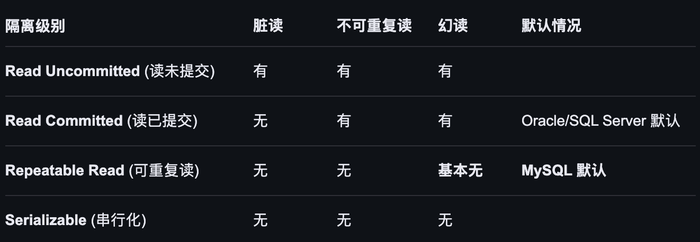
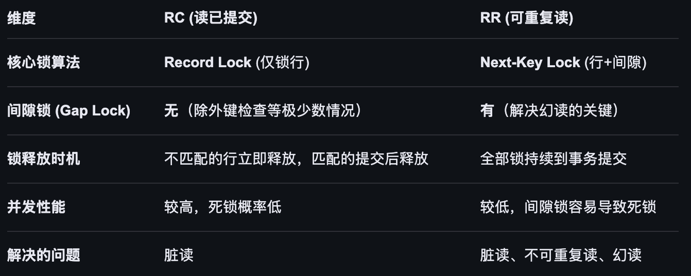

## 开启事务
- MySQL默认处于自动提交模式（SET autocommit = 1;）,每条语句都会默认开启事务

- 要将多行语句放在一个事务中有以下办法
    - 不管autocommit 是1还是0 ，start transaction 后，只有当commit数据才会生效，rollback后就会回滚
    - 当autocommit 为 0 时，不管有没有start transaction。只有当commit数据才会生效，rollback后就会回滚

## 事务特性
### 原子性(Atomicty)
- 事务是一个整体,事务中的所有操作要么全部成功提交,要么全部全部失败回滚,不能停留在中间状态
- 通过Undo Log的反向操作回滚事务已执行的部分
### 一致性(Consistency)
- 事务执行前后,必须保证数据不会错乱,要符合预期,是事务追求的最终目标
- 内部通过原子性,隔离性,持久性共同支撑,外部依靠数据库约束和业务逻辑的正确性保证
### 隔离性(Isolation)
- 多个事务并发执行时，不能相互影响
- 依靠锁机制和MVCC保证
### 持久性(Durability)
- 事务一旦提交,其对数据库的更改就是永久性的,即使数据库崩溃数据也不会丢失
- 通过RedoLog保证:使用WAL技术先写RedoLog再写Buffer Pool,即使Buffer Pool中的脏页未刷盘mysql就崩溃也可以通过RedoLog恢复
## 事务问题
- 脏读:一个事务中读到其他事务未提交的数据
- 不可重复读:一个事务中多次相同查询读取数据内容不一致
- 幻读:一个事务中多次相同查询读取数据条数不一致
## 事务隔离级别
### 读未提交
Read Uncommitted
- 事务A可以读取到事务B尚未提交的修改
- 有脏读,不可重复读,幻读等问题
### 读已提交
Read Committed
- 事务中只能读取到其他事务已经提交的数据
- 每次查询都会生成一个新的Read View,多次读取可能结果不一致,所以有不可重复读和幻读问题
### 可重复读
- 事务中多次相同查询读取到的数据是一致的
- 通过Next-Key Lock(行锁+间隙锁)很大程度上解决了幻读问题,但存在以下幻读问题
    - 事务A 执行select * from user where id=5,结果为空
    - 事务B 执行插入id=5的数据并提交了
    - 事务A执行对id=5的数据的修改操作 (update是当前读,能看到事务B提交的最新数据,会修改成功)
    - 事务A再次执行执行select * from user where id=5,能够查到数据,因为id=5的数据的事务ID由于上一步的修改操作变成了它自己的事务ID

## mvcc
### 隐藏字段
InnoDB为每行记录自动添加以下隐藏字段
- DB_TRX_ID 记录最新修改该行数据的事务ID
- DB_ROLL_PTR 回滚指针,指向该行数据在UndoLog中的上一个版本
- DB_ROW_ID 行ID,如果指定了主键则使用主键,否则如果有唯一非空索引就使用唯一非空索引,否则MySQL回自动生成一个自增的6字节整数作为DB_ROW_ID

### Undo Log版本链
每当数据被修改时，旧版本就会被写入UndoLog,并通过DB_ROLL_PTR串联起来

### ReadView生成

#### 关键信息
事务进行快照读时产生的快照,它包含以下几个关键信息:
- m_ids,生成视图时系统中活跃且未提交的事务ID列表
- min_trx_id,活跃事务ID中的最小值
- max_trx_id,预分配给下一个事务的ID(当前最大事务ID+1)
- creator_trx_id,当前事务ID

#### 生成算法
事务读取一行数据时,它会拿着当前行的DB_TRX_ID事务ID去和关键信息比对自己的Read View,沿着版本链找到符合以下规则的第一个版本
- 如果DB_TRX_ID等于当前事务ID,说明是自己修改的数据,可见
- 如果DB_TRX_ID小于活跃事务列表最小事务ID,说明修改该行的事务已经提交,可见
- 如果DB_TRX_ID大于等于max_trx_id,说明修改该行的事务在生成视图之后才开启,不可见
- 如果DB_TRX_ID在活跃事务列表最小事务ID和max_trx_id之间
    - 如果DB_TRX_ID在活跃事务列表中,说明修改该条数据的事务还未提交,不可见
    - 如果DB_TRX_ID不在活跃事务列表中,说明修改该条数据的事务已经提交,可见

### 生成时机
- RC读已提交隔离级别下每次执行查询语句都会重新生成READ VIEW
- RR可重复读隔离级别下第一次执行查询语句时生成,后面复用
## 锁

### 读锁
读锁,又叫S锁,共享锁,允许多个事务读取同一资源,但阻止任何事务修改该资源
- 读-读 兼容 如果事务 A 对某行加了读锁，事务 B 也可以对同一行加读锁。两者互不干扰。
- 读-写 冲突 如果事务 A 持有某行的读锁，事务 B 想对该行加写锁（排他锁/X 锁）进行修改，则事务 B 必须等待 A 释放锁。

#### 分类和加锁时机
- 行级读锁
    - 显式行级读锁 
        - 通过SELECT ... LOCK IN SHARE MODE (8.0 后推荐 SELECT ... FOR SHARE)手动加锁
    - 隐式行级读锁
        - Serializable 隔离级别：在该级别下，普通的 SELECT 会被自动转换为 LOCK IN SHARE MODE，即所有查询都强制加读锁
        - 当你插入或更新一张从表时，InnoDB 会自动对主表关联的行加 S 锁，以确保参照完整性（防止主表数据在你操作中途被删）
- 表级读锁
    - 语法: LOCK TABLES table_name READ; 常用于全表逻辑备份或大范围数据迁移。执行后，当前连接只能读该表，不能写；其他连接也只能读，不能写
- 意向读锁
    - 当事务想给某一行加 S 锁 之前，会先自动给整张表加一个 IS 锁,如果有另一个事务想给整张表加 写锁（X 锁），它只需要看一眼表上是否有 IS 锁，就知道表里肯定有行被占用了，而不需要去逐行扫描，极大提升了效率

#### 与MVCC的关系
在 InnoDB 中，普通的 SELECT 是不加读锁的。
- 快照读 (Snapshot Read)：普通的查询利用 MVCC 读取历史版本（Undo Log）。它既不加锁，也不会被写锁阻塞。这是 MySQL 高并发的基础。
- 加锁读 (Locking Read)：只有当你使用 FOR SHARE 或在特殊隔离级别下，才会真正触发上文提到的 S 锁。此时读取的是数据的最新版本（当前读）

### 写锁
写锁,又叫X锁,排他锁
- 写-写 冲突 事务 A 持有 X 锁，事务 B 想加 X 锁修改数据，必须等待 A 释放。
- 写-读 冲突 事务 A 持有 X 锁，事务 B 想通过 FOR SHARE 加读锁读取最新数据，必须等待 A 释放。
    - 特例（MVCC）：事务 A 持有 X 锁时，事务 B 执行普通 SELECT 是可以成功的。因为普通查询走的是 MVCC（快照读），读取的是 Undo Log 里的历史版本，不需要申请锁。

#### 分类和加锁时机
- 行级写锁
    - 显式行级写锁
        - 通过SELECT ... FOR UPDATE手动加锁
    - 隐式行级写锁,执行 DML 语句修改数据时，InnoDB 会自动加锁,在事务执行这些操作的瞬间加锁，直到事务提交（COMMIT）或回滚（ROLLBACK）时才释放
        - INSERT：插入新行时
        - UPDATE：修改现有行时
        - DELETE：删除行时
- 表级写锁
    - LOCK TABLES table_name WRITE; 当前连接可以读写该表；其他连接的所有读写操作都会被阻塞，直到锁释放。通常仅用于重大的数据迁移或结构变更。
- 意向写锁(IX)
    - 事务在给某行加 X 锁 之前，必须先获得该表的 IX 锁,当另一个事务想执行 LOCK TABLES ... WRITE 锁全表时，只需检查表上是否有 IX 锁。如果有，说明表里已经有行被锁住了，直接进入等待，而不需要去扫描几百万行数据
### 锁实现

#### 行锁具体实现
以下是InnoDB内部提供的几种锁,他们决定了锁住记录的范围,他们可以是读锁或者写锁
- Record Lock (记录锁)：仅锁定索引记录本身。
- Gap Lock (间隙锁)：锁定记录之间的“空隙”，但不包含记录本身。它的实现是在索引记录的位图上打一个特殊的“间隙标志”，防止其他事务插入（Insert Intention Lock）。
- Next-Key Lock (临键锁)：Record + Gap 的组合。它是 RR 级别的默认实现，锁住一个左开右闭的区间 (previous_key, current_key]。

### 死锁
MySQL 的死锁（Deadlock）是数据库并发操作中极其经典的问题。简单来说，就是两个或多个事务在执行过程中，因争夺锁资源而造成的一种互相等待的现象。

如果没有外部干预，这些事务将永远僵持下去。好在 InnoDB 引擎有死锁检测机制（Deadlock Detector），它会主动牺牲一个权重较小的事务（回滚），让其他事务继续执行。

#### 预防死锁的实战策略
- 降低隔离级别： 如果业务允许，将隔离级别从 Repeatable Read (RR) 改为 Read Committed (RC)，可以消除大部分间隙锁导致的死锁。
- 缩短事务逻辑： 事务越长，持锁时间越久，碰撞概率越高。尽量把非数据库操作（如调用外部 API）移出事务。

- 使用合适的索引： 如果 UPDATE 语句没走索引，InnoDB 会倾向于锁住整个范围甚至全表（退化为表锁或大量的临键锁），极易导致死锁。
- 固定访问顺序（最有效）： 确保所有业务逻辑都以相同的顺序操作表和行。例如，始终先处理 id=1 再处理 id=2。

- 批量操作排序： 对 in (1, 3, 2, 5) 这种批量更新，在代码层面先对 ID 进行升序排序后再执行。