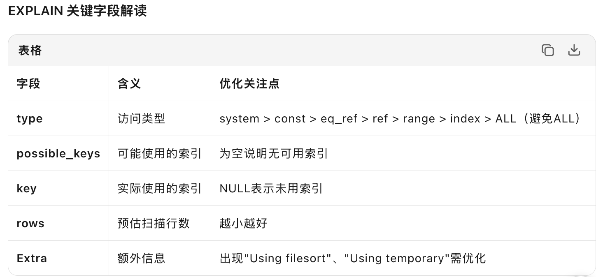
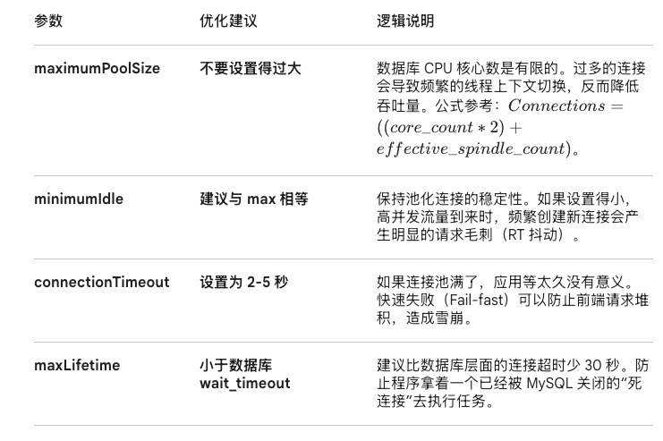

## 慢SQL定位
### 开启慢查询日志
```sql
-- 查看当前慢查询配置
SHOW VARIABLES LIKE 'slow_query%';
SHOW VARIABLES LIKE 'long_query_time';

-- 动态开启（无需重启，但重启后失效）
SET GLOBAL slow_query_log = 'ON';
SET GLOBAL slow_query_log_file = '/var/lib/mysql/slow.log';
SET GLOBAL long_query_time = 2;  -- 超过2秒的SQL记录
SET GLOBAL log_queries_not_using_indexes = 'ON'; -- 记录未使用索引的查询

-- 永久配置：修改 my.cnf
[mysqld]
slow_query_log = 1
slow_query_log_file = /var/lib/mysql/slow.log
long_query_time = 2
log_queries_not_using_indexes = 1
```
### 定位慢sql

#### mysqldumpslow慢查询日志分析
```shell
# 使用 mysqldumpslow 工具分析
mysqldumpslow -s t -t 10 /var/lib/mysql/slow.log  # 按时间排序，取前10条
mysqldumpslow -s c -t 10 /var/lib/mysql/slow.log  # 按次数排序
# 常用参数
-s t: 按总时间排序
-s c: 按总次数排序  
-s l: 按锁定时间排序
-s r: 按返回记录数排序
-t n: 返回前n条
-g pattern: 正则匹配
```

#### performance_schema实时分析

```sql
    -- 开启相关监控（MySQL 5.6+）
    UPDATE performance_schema.setup_consumers SET ENABLED = 'YES' 
    WHERE NAME LIKE '%events_statements%';

    UPDATE performance_schema.setup_instruments SET ENABLED = 'YES', TIMED = 'YES'
    WHERE NAME LIKE '%statement/%';

    -- 查询最慢的SQL（按平均执行时间）
    SELECT 
        DIGEST_TEXT as query,
        SCHEMA_NAME as db,
        COUNT_STAR as exec_count,
        ROUND(AVG_TIMER_WAIT/1000000000, 2) as avg_time_ms,
        ROUND(MAX_TIMER_WAIT/1000000000, 2) as max_time_ms,
        ROUND(SUM_TIMER_WAIT/1000000000, 2) as total_time_ms,
        SUM_ROWS_SENT as total_rows_sent,
        SUM_ROWS_EXAMINED as total_rows_examined,
        FIRST_SEEN, LAST_SEEN
    FROM performance_schema.events_statements_summary_by_digest
    WHERE SCHEMA_NAME IS NOT NULL
    ORDER BY AVG_TIMER_WAIT DESC
    LIMIT 10;
```
### 单条SQL分析

#### Explian

```sql
EXPLAIN FORMAT=JSON SELECT * FROM users WHERE age > 20;
-- 或
EXPLAIN ANALYZE SELECT * FROM users WHERE age > 20;  -- MySQL 8.0.18+
```


#### performance_schema

```sql
-- MySQL 5.7 可用
SET profiling = 1;
SELECT * FROM large_table WHERE status = 'pending';
SHOW PROFILES;
SHOW PROFILE FOR QUERY 1;  -- 查看各阶段耗时

-- MySQL 8.0 替代方案
SELECT EVENT_NAME, SQL_TEXT, TIMER_WAIT/1000000000 as duration_ms
FROM performance_schema.events_statements_history_long
WHERE SQL_TEXT LIKE '%large_table%'
ORDER BY TIMER_WAIT DESC;
```


## SQL优化

### 索引失效及优化

#### 类型转换
```sql
-- 表结构：user_id VARCHAR(20)，但实际存数字
-- ❌ 失效：传入数字，MySQL会转换所有行的user_id为数字再比较
SELECT * FROM logs WHERE user_id = 12345;

-- ✅ 优化：严格匹配类型
SELECT * FROM logs WHERE user_id = '12345';

-- ❌ 失效：字符集不一致（关联查询时常见）
SELECT * FROM utf8_table t1 
JOIN latin1_table t2 ON t1.name = t2.name;  -- 字符集转换导致索引失效

-- ❌ 失效：CAST/CONVERT导致索引失效
SELECT * FROM orders WHERE CAST(user_id AS UNSIGNED) = 123;

-- ❌ 失效：日期格式化
SELECT * FROM logs WHERE DATE_FORMAT(create_time, '%Y-%m') = '2024-03';

-- ✅ 优化：范围查询替代
SELECT * FROM logs 
WHERE create_time >= '2024-03-01' AND create_time < '2024-04-01';
```

#### 索引列使用函数

```sql
-- ❌ 失效：对create_time使用YEAR函数
SELECT * FROM orders WHERE YEAR(create_time) = 2024;
-- ✅ 优化：改写为范围查询
SELECT * FROM orders 
WHERE create_time >= '2024-01-01' AND create_time < '2025-01-01';
```

#### 索引列参与计算

```sql
-- ❌ 失效：数学运算
SELECT * FROM products WHERE price * 0.8 > 100;

-- ✅ 优化：移项计算
SELECT * FROM products WHERE price > 100 / 0.8;
```

#### 不符合最左前缀

##### 字符串最左前缀
```sql
-- ✅ 优化方案1：全文索引（MySQL 5.6+ InnoDB支持）
CREATE FULLTEXT INDEX idx_title ON articles(title);
SELECT * FROM articles WHERE MATCH(title) AGAINST('MySQL');

-- ✅ 优化方案2：倒排表/ES等外部搜索引擎
-- ✅ 优化方案3：如果必须模糊查，用覆盖索引减少回表
SELECT id, title FROM articles WHERE title LIKE '%MySQL%';  -- 只查索引字段
```
##### 联合索引最左前缀
```sql
-- 索引：INDEX idx_a_b_c (a, b, c)

-- ❌ 部分失效：a用索引后,c不走索引
SELECT * FROM table WHERE a = 100 AND c = 3;

-- ❌ 完全失效
SELECT * FROM table WHERE b = 200 AND c = 3;

-- ✅ 可以完全利用联合索引 优化器会优化为正确顺序
SELECT * FROM  c = 3 AND a = 100 AND b=200;
```

#### 范围查询

返回查询不会直接导致全表扫描，但当匹配数据过多时，优化器会主动放弃索引选择全表扫描——这不是Bug，而是成本优化的结果。强制索引往往适得其反，覆盖索引才是正解。

#### OR和索引列并用

```sql
-- ❌ 可能失效：OR两边条件涉及不同索引
SELECT * FROM users WHERE id = 1 OR age = 20;
-- id有索引，age无索引 → 可能全表扫描

-- ✅ 优化方案1：分别查询后UNION（数据量大时）
SELECT * FROM users WHERE id = 1
UNION ALL
SELECT * FROM users WHERE age = 20;

-- ✅ 优化方案2：确保OR两边都有索引，或改写为IN
SELECT * FROM users WHERE id IN (1, 2, 3);  -- IN通常能走索引
```

#### NOT IN/NOT EXISTS/<>

```sql
-- ❌ 通常不走索引（需要扫描全表排除）
SELECT * FROM users WHERE id NOT IN (1, 2, 3);
SELECT * FROM users WHERE status <> 'active';

-- ✅ 优化方案1：改写为LEFT JOIN排除
SELECT u.* FROM users u
LEFT JOIN (SELECT id FROM users WHERE id IN (1,2,3)) tmp ON u.id = tmp.id
WHERE tmp.id IS NULL;

-- ✅ 优化方案2：业务层面取反（先查有效再排除）
-- 或在8.0+版本，数据量小时优化器可能自动优化
```

#### 低区分度索引

```sql
-- 性别字段只有男女两种值，索引区分度≈50%
-- MySQL优化器可能认为全表扫描更快

SELECT * FROM users WHERE gender = 'M';  -- 可能不走索引

-- ✅ 优化：与区分度高的字段建立联合索引
CREATE INDEX idx_gender_city ON users(gender, city);  -- city区分度高
-- 查询时：WHERE gender = 'M' AND city = 'Beijing';
```

### 连接查询优化

```sql
-- ✅ 小表驱动大表（MySQL自动优化，但JOIN顺序可强制）
SELECT * FROM small_table s 
JOIN large_table l ON s.id = l.small_id;

-- ✅ 确保被驱动表有索引
-- 驱动表：small_table（全表扫描或索引扫描）
-- 被驱动表：large_table（通过small_id索引查找）

-- ❌ 避免多表JOIN（超过3个表性能急剧下降）
-- 考虑：应用层多次查询组装 或 冗余字段

-- ✅  straight_join 强制驱动顺序（确定小表时）
SELECT STRAIGHT_JOIN * FROM small_table s JOIN large_table l ON s.id = l.small_id;
```

### 使用覆盖索引

```sql
-- 覆盖索引（避免回表）
-- 查询：SELECT id, name FROM users WHERE name = 'Tom'
CREATE INDEX idx_name_id ON users(name, id);  -- 包含所有查询字段
```

### 排序与分组优化
```sql
-- ✅ 利用索引排序，避免 filesort
-- 索引：INDEX idx_user_time(user_id, create_time)
SELECT * FROM orders WHERE user_id = 100 ORDER BY create_time DESC;
-- Extra: Using index condition（无filesort）

-- ❌ 混合排序方向（8.0前不支持）
ORDER BY create_time DESC, id ASC  -- 可能filesort

-- ✅ 分组优化：索引覆盖分组字段
-- 索引：INDEX idx_status(status)
SELECT status, COUNT(*) FROM orders GROUP BY status;

-- ❌ 分组后HAVING过滤大数据
SELECT user_id, COUNT(*) as cnt FROM orders GROUP BY user_id HAVING cnt > 100;
-- ✅ 先子查询缩小范围，或冗余统计字段
```

## 连接池优化

