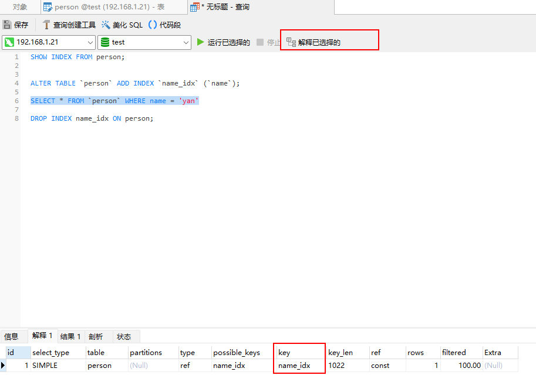
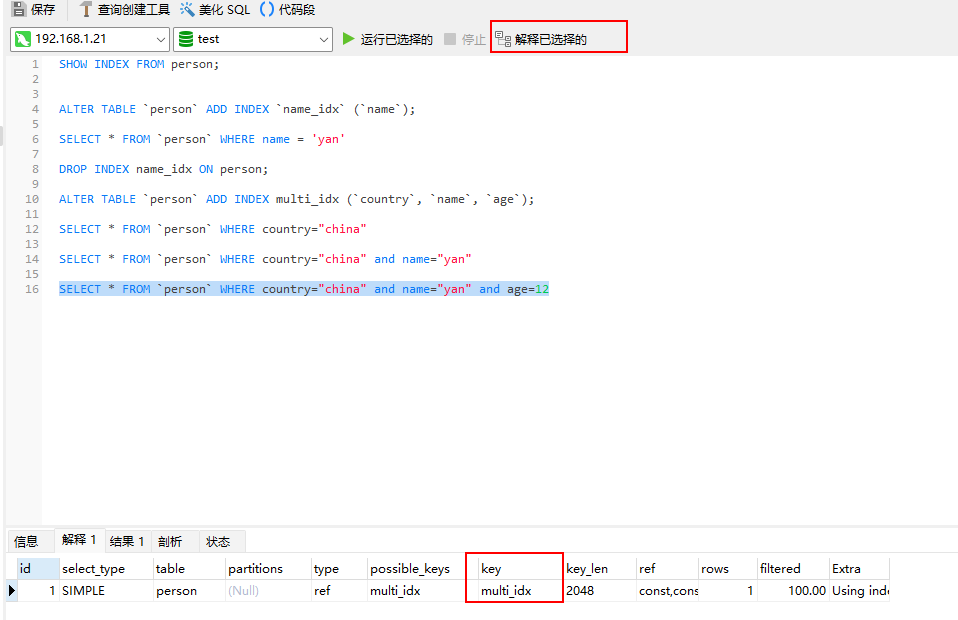

## 索引结构
mysql索引是B+树数据结构,每一层是下一层的目录,非叶子节点不存储数据只存储索引,所以每个节点可以存放更多索引,数据按顺序存储在叶子节点,叶子节点通过指针相连,形成一个可以遍历的有序链表。
B树和B+树

## 索引分类

### 按存储方式
- 聚簇索引:Innodb的聚簇索引又叫主键索引,是以主键为索引建立的B+树,叶子节点存储所有的数据
- 非聚簇索引:非聚簇索引的叶子节点只存储索引列和主键,要查询完整数据需要回表(再通过主键去聚簇索引查询)

### 按特性分类
- 主键索引: 一张表只能有一个主键索引 索引列值不允许为空 一般在建表时创建
- 唯一索引: 建立在UNIQUE列上的索引被称为唯一索引，可以有多个，索引列值可以为空(不会违反UNIQUE)。
- 普通索引: 建立在普通字段上的索引
- 全文索引: MyISAM支持Full-Text索引，用于关键词搜索，一般用倒排索引实现。

### 按索引列数
- 联合索引:多个列组成的索引
  - 覆盖索引:索引中包含了要查询的所有列
- 单列索引:索引只包含单列。

## 索引管理
- 查看索引
SHOW INDEX FROM person;
- 创建索引
ALTER TABLE `person` ADD INDEX `name_idx` (`name`);
- 删除索引
DROP INDEX name_idx ON person;
## 使用索引
- 建表
    ```SQL
    CREATE TABLE `person` (
    `id` bigint NOT NULL AUTO_INCREMENT,
    `country` varchar(255) COLLATE utf8mb4_0900_as_cs NOT NULL,
    `name` varchar(255) COLLATE utf8mb4_0900_as_cs NOT NULL,
    `age` int NOT NULL,
    PRIMARY KEY (`id`)
    ) ENGINE=InnoDB DEFAULT CHARSET=utf8mb4 COLLATE=utf8mb4_0900_as_cs;   
    ```
- 普通索引
    ```SQL
    ALTER TABLE `person` ADD INDEX `name_idx` (`name`);
    SELECT * FROM `person` WHERE name = 'yan'
    ```
    
- 联合索引
    ```SQL
    DROP INDEX name_idx ON person;

    ALTER TABLE `person` ADD INDEX multi_idx (`country`, `name`, `age`);

    --- mysql5.7开始会把优化顺序 顺序无所谓 不能缺列 bca可以优化为abc bc缺列不能优化
    SELECT * FROM `person` WHERE country="china"

    SELECT * FROM `person` WHERE country="china" and name="yan"

    SELECT * FROM `person` WHERE country="china" and name="yan" and age=12
    ```
    

## 索引失效
索引失效的原因是因为未能够合理建立索引或错误使用搜索条件导致了mysql未能形成有效的搜索区间进而进行全表扫描。
- 字符串索引模糊搜索未能遵循最左前缀
- 在索引上使用函数或计算或类型转换
- 使用联合索引时未按定义顺序最左匹配(a-b-c 只使用了ac或只使用了bc)
- 使用不等于/not in/is not null等会造成全表扫描的语句
- or后面存在非索引列也会造成全表扫描

## 索引选择性
索引的选择性是指索引列中不同值的数量与总行数的比值,选择性越高表示索引列的区分度越高,在条件中有多个索引的情况会优先使用选择性高的。

## 索引下推
Index condition pushdown,是mysql5.6之后对联合索引的一种优化策略,在联合索引中可以利用不符合最左前缀的列来过滤将要回表的数据
- 索引--(first_name,last_name)
- SQL where first_name='Mery' and last_name='%ming'
- 根据first_name查询到联合索引的数据,逐行根据last_name='%ming'条件过滤后再回表。

## 回表
- MRR 从最小id遍历到最大id,过滤出符合条件的结果，把随机io转换成了顺序io
- 逐一回表,每个id单独去主键索引回表查询结果。
mysql会估算二者的开销决定使用哪种策略。

