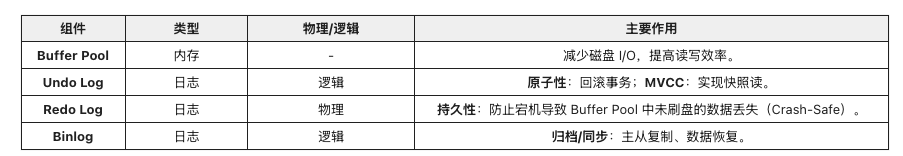
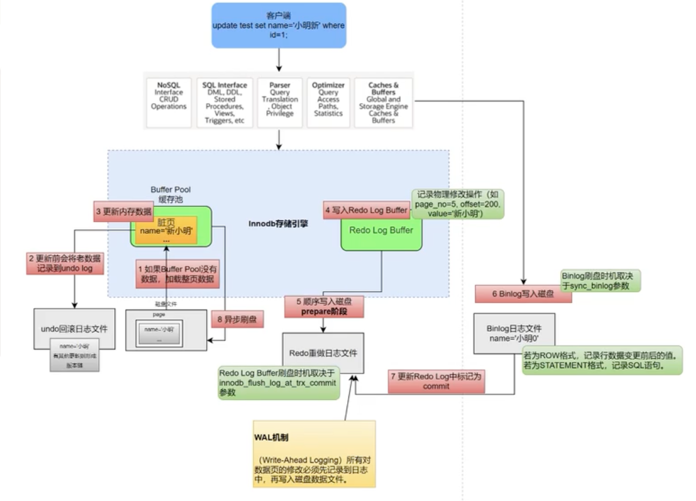
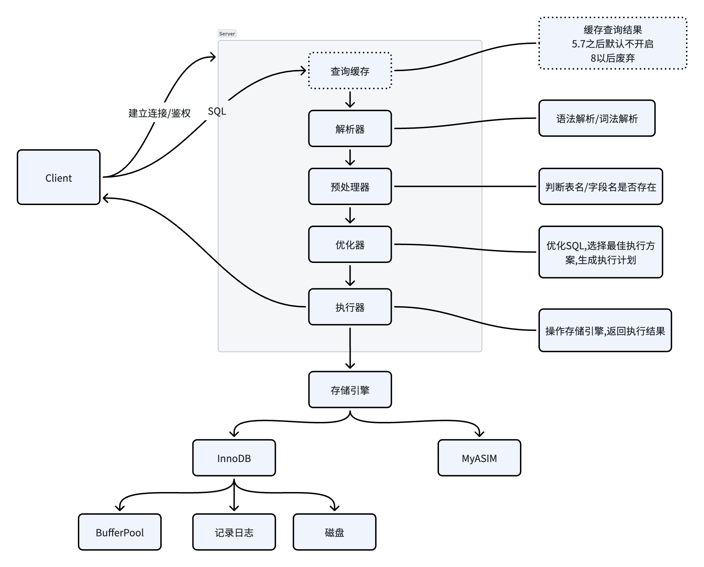

## 前置知识

## 写入过程

### 准备工作(Server层)
- 客户端模块鉴权
- 查询缓存(8.x已经删除),如果开启先清理相关缓存
- 解析器对SQL进行语法分析词法分析
- 预处理器合法性校验判断表和字段是否存在
- 优化器对SQL优化并生成执行计划
- 执行器拿到执行计划去调用底层存储引擎

### 内存更新
- InnoDB检查数据是否在内存中的Buffer Pool中,如果不在,从磁盘加载整页数据到Buffer Pool中
- 给该行加上记录锁
- 将更新前到数据记录到UndoLog(用于回滚和MVCC读)
- 修改内存中Buffer Pool的对应数据,此时,该页变为脏页
- 写Redo Log Buffer,将物理修改记录(在某个页做了什么)写入内存中的Redo Log缓冲区

### 两阶段提交
- Prepare阶段: 将Redo Log Buffer的数据刷入磁盘,并将Redo Log的事务状态标记为PREPARE
- 写Binglog: Server层将逻辑日志(SQL或ROW格式)写入Binlog Cache,并刷入磁盘
- Commit阶段: Server层调用存储引擎的提交接口,将Redo Log的事务状态改为COMMIT

#### 崩溃恢复
- Prepare阶段未完成崩溃 - 对应Binlog不存在 - 回滚
- Prepare阶段完成还没开始写Binlog崩溃 - 对应Binlog不存在 - 回滚
- Prepare阶段完成Binlog还未完成崩溃 - Binlog不完整(查看Binlog头中长度和body实际长度是否一致) - 回滚
- Prepare阶段完成Binlog写完之后崩溃 - Redo Log处于Prepare阶段且有完整Binlog-提交
## 查询过程
- 客户端模块鉴权
- 查询缓存(8.x已经删除),如果开启且缓存中有相同sql的结果直接返回
- 解析器对SQL进行语法分析词法分析
- 预处理器合法性校验判断表和字段是否存在
- 优化器对SQL优化并生成执行计划
- 执行器拿到执行计划去调用底层存储引擎
- 存储引擎先去Buffer Pool中查询数据,如果没有再去磁盘中将数据所在页整个加载到内存并将对应数据返回给执行器
- 执行器将结果汇总,组成结果集返回

