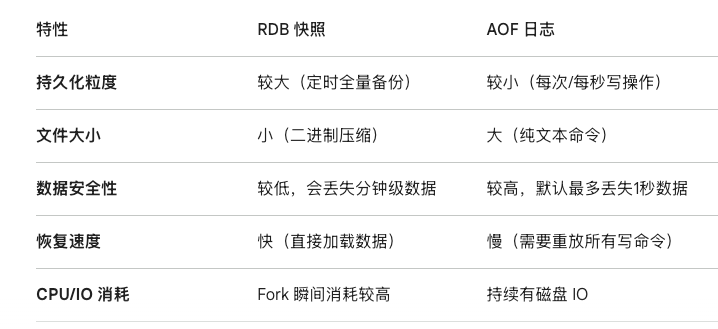
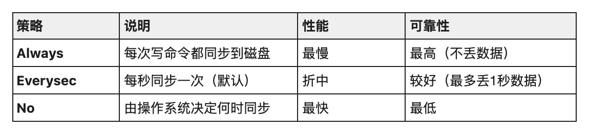

## 数据类型

### 字符串
- 最基础的KV存储,常用于缓存JSON,计数器等
- 底层使用SDS实现
    - C字符串以\0结尾,获取长度需要O(N)时间,且非二进制安全
    - SDS内部维护长度和分配空间,获取长度O(1),支持空间预分配和惰性释放,避免频繁内存分配。
### 列表
- 用于存储有序字符串列表,常用于栈和队列
- 底层使用Quicklist实现
    - 它是一个双向链表,链表的每个节点都是一个Ziplist,这样既能快速移动指针,又能通过连续内存块减少内存碎片

### Set
- 用于存储无序去重集合,常用于社交关系共同关注,抽奖系统等
- 使用Intset或Hashtable实现
    - 如果集合内全是整数且数量不多,底层使用Intset在一块连续的内存存储
    - 如果内容包含字符串或元素过多,退化为值为NULL的哈希表存储

### ZSet
- 元素带权重(Score)的集合,会根据Score自动排序,常用于排行榜,限流器等
- 使用Skiplist+Hashtable实现
    - 跳表通过多层索引实现类似二分查找的效果,平均复杂度为O(logN)
    - 同时维护一个哈希表,用于存储成员到Score到映射

### Hash
- 常用于存储对象,可单独修改某个字段的值
- 底层使用Hashtable或Ziplist实现
    - 当元素个数较少时使用Ziplist在连续内存存储
    - 当数量较大时转为真正的哈希表,采用链地址法解决冲突,并支持渐进式Refresh(在存取过程中缓慢迁移数据,避免瞬时阻塞)

### Bitmap
本质是String,可通过SETBIT等运算直接操作二进制位,极省空间

### 淘汰策略
当 Redis 的内存占用达到 maxmemory 限制时，就会根据触发淘汰策略
- no-envicition -- 写请求不再提供服务，会直接返回错误,redis默认使用该策略
- allkeys-random -- 随机选取key进行淘汰
- allkeys-lru -- 使用LRU（Least Recently Used，最近最少使用）算法，从redis中选取使用最少的key进行淘汰
- volatile-random -- 从设置过过期时间的key，进行随机淘汰
- volatile-ttl -- 选取即将过期的key，进行淘汰
- volatile-lru -- 使用LRU算法，从设置过过期时间的key中选取最近最少使用的key进行淘汰
- volatile-lfu -- 使用LFU（Least Frequently Used，最不经常使用），从设置了过期时间的键中选择某段时间之内使用频次最小的键值对清除掉
- allkeys-lfu -- 使用LFU（Least Frequently Used，最不经常使用），从所有的键中选择某段时间之内使用频次最少的键值对清除

## 过期删除策略

### 定期删除
策略描述： Redis 会周期性地（默认每秒 10 次）从设置了过期时间的键中随机抽取一部分进行检查，并删除其中已过期的键。

执行流程：

- 从过期字典中随机测试 20 个键。

- 删除所有已过期的键。

- 如果超过 25% 的键被删除，循环执行上述步骤（但会有总时间限制，防止阻塞主线程）。

优点： 通过限制删除操作的时长和频率，减少对 CPU 的影响，同时能有效清理部分过期键。

缺点： 依然无法保证所有过期键都能被即时删除。

### 惰性删除
当客户端尝试访问某个键时，Redis会检查该键是否已过期。如果过期，则删除它并返回 nil；如果未过期，则正常返回。

优点： 对 CPU 极度友好。只有在访问时才处理，不会浪费 CPU 时间在那些永远不会被访问的过期键上。

缺点： 对内存不友好。如果大量键已经过期，但一直没有被访问，它们会一直占用内存，造成内存泄漏。

## 日志

### RDB
RDB是Redis默认的持久化方式，它在指定的时间间隔内,将内存中当前时刻的全量数据生成一个二进制文件(通常是dump.rdb)保存到磁盘
- 优点: 文件紧凑,适合备份和灾难恢复,恢复速度比AOF快很多
- 缺点:会丢失数据,如果redis宕机,最后一次快照之后的修改会丢失
#### 工作原理
当触发RDB持久化时,Redis会调用fork()创建一个子进程:
- 写时复制(COW): 子进程共享父进程的物理内存数据
    - 子进程写入期间,父进程继续处理客户端请求,如果有写操作,会为受影响的内存页创建副本,保证子进程看到的依然是fork瞬间的快照
- 序列化: 子进程将内存数据写入一个临时的RDB文件
- 原子替换: 写入完成后,用临时文件替换旧的RDB文件

#### 触发时机
- 手动执行SAVE(阻塞主线程)或BGSAVE(后台异步)
- 根据redis.conf中的save配置,如save 900 1(900s内有一次修改则触发)
- 主从同步: 从节点连接主节点时,主节点会生成RDB发送给从节点

### AOF
AOF记录的是Redis执行的所有写命令(如SET,DEL等),以文本协议的形式追加到日志文件(通常是appendonly.aof)

#### 工作原理
- 命令追加: 命令先写入aof_buf缓冲区
- 文件同步: 根据策略将缓冲区的内容刷新到磁盘
- 文件重写: 随着时间推移,AOF文件会变得很大,Redis会根据内存中当前的最新数据，生成一套能够重建这些数据的最小命令集

**文件同步策略**
    


## 缓存失效

### 缓存击穿

#### 场景
热点key在过期的瞬间,比如秒杀商品的库存过期瞬间,海量请求并发过来,缓存失效了,压力落到数据库上,导致数据库资源耗尽挂掉。

#### 解决方案
- 设置热点数据用不过期
- 或者使用互斥锁加载数据

### 缓存穿透

#### 场景
请求的数据在缓存和数据库中都不存在,所有非法请求都穿透到数据库,导致数据库压力过大

#### 解决方案

- 缓存空对象 (未查到的数据缓存值设为空,下次相同请求在进来就能走缓存)
- 使用布隆过滤器(使用哈希算法将存在的值hash到bitmap对应的位上并将该位设置为1,请求过来同样hash到bitmap对应的位,查看是否为1)

### 缓存雪崩

#### 场景
大量缓存在同一时间失效,或者redis宕机,导致大量请求落到数据库上，数据库压力过大

#### 解决方案
设置过期时间时加上随机值，分散失效时间，使用redis集群提高可用性

## 分布式锁

在 Redisson 的设计中，HEXISTS 是实现 可重入锁 (Reentrant Lock) 的核心逻辑之一。
Redisson 并没有使用简单的 String 类型（SETNX），而是采用了 Hash（哈希） 数据结构。这个 Hash 的结构通常是：
- Key: 锁的名字（如 order_lock）。
- Field: 线程标识（UUID + threadId）。
- Value: 锁的重入计数（Counter）。
1. HEXISTS 在加锁流程中的角色
当你调用 lock.lock() 时，Redisson 会执行一段 Lua 脚本。HEXISTS 在这里起到“身份识别”的作用：
1. 判断锁是否存在：首先检查 exists key。
2. 判断是否是“我”持有的锁：如果锁已存在，Redisson 会使用 HEXISTS key field。
  - 如果返回 1：说明当前线程就是这把锁的拥有者，直接执行 HINCRBY 将 Value 加 1（实现可重入）。
  - 如果返回 0：说明锁被其他线程占用，当前线程开始等待或重试。

---
### 核心 Lua 脚本解析
这是 Redisson 加锁代码的简化逻辑，你可以清楚地看到 hexists 的位置：
```Lua
-- 参数说明：KEYS[1] 是锁名, ARGV[2] 是线程标识 (UUID:ThreadId)-- 1. 如果锁不存在，直接加锁
if (redis.call('exists', KEYS[1]) == 0) then
    redis.call('hset', KEYS[1], ARGV[2], 1);
    redis.call('pexpire', KEYS[1], ARGV[1]);
    return nil;
end;

-- 2. 如果锁已存在，判断是不是当前线程持有的（可重入检查）
if (redis.call('hexists', KEYS[1], ARGV[2]) == 1) then
    redis.call('hincrby', KEYS[1], ARGV[2], 1); -- 重入次数 +1
    redis.call('pexpire', KEYS[1], ARGV[1]);    -- 续期return nil;
end;

-- 3. 锁被别人占用，返回剩余有效期 return redis.call('pttl', KEYS[1]);
```
---
为什么必须用 HEXISTS 而不是 EXISTS？
假设有一个“扣减库存”的操作：
- 普通 SETNX 锁：只能记录“锁了”或者“没锁”。如果同一个线程在 A 方法里拿了锁，调用 B 方法又要拿锁，SETNX 会把自己挡在外面，造成死锁。
- Redisson Hash 锁：通过 HEXISTS 确认“你是自己人”，允许你再次进入。这对于复杂的业务逻辑（如：订单服务调用优惠券服务，两者都需要锁定同一个商家 ID）至关重要。

---
### 释放锁时的逻辑
在解锁（unlock）时，Redisson 也会用到类似逻辑：
1. 先 HEXISTS 检查锁是不是你的。
2. 如果是，用 HINCRBY -1 递减。
3. 当计数减到 0 时，说明所有重入的方法都执行完了，执行 DEL 彻底释放锁。
5. 总结：Redisson 的精妙之处
Watchdog 续签时执行的 Lua 脚本非常简洁，它再次利用了我们刚才提到的 HEXISTS：

```Lua
-- KEYS[1] 锁名, ARGV[1] 续期时间 (30000ms), ARGV[2] 线程标识
if (redis.call('hexists', KEYS[1], ARGV[2]) == 1) then
    redis.call('pexpire', KEYS[1], ARGV[1]);
    return 1;
end;
return 0;
```
逻辑： 只有锁确实还是“你”持有的，才执行 PEXPIRE。默认每过10s重置过期时间为30s

---
### 总结
通过使用 Hash 结构和 HEXISTS 命令，Redisson 完美模拟了 Java 原生的 ReentrantLock 在分布式环境下的行为：
- 多维度信息：一个 Key 存了锁名、持有人、重入次数。
- 原子性：利用 Lua 脚本确保 HEXISTS 检查和后续的 HINCRBY 是在一个原子操作内完成的，避免了并发下的竞态条件。

## 数据倾斜

### 槽位分配不均


### 大key
如果一个Hash或List等类型,存储了大量元素,即使哈希槽位分布均匀,该节点占用的内存也会远超其他节点

#### 解决方案
可以将大Key拆分成很多小Key,比如user:fans拆分成user:fans:1到user:fans:10

### 热点key
即使每个节点数据量相同,如果每个key是非常频繁访问的热点key,该节点资源占用也会比其他节点高

#### 解决方案
加本地缓存,访问Redis前先看本地缓存有没有,Redis 6.0 Client-Side Caching机制可以在Redis数据更新时主动推送给客户端

### Hash Tag滥用

Redis Cluster 使用 CRC16(key) % 16384计算槽位,如果使用了{Tag}定义HashTag,会强制Redis根据Tag计算槽位,如果大量数据使用相同Tag会造成部分节点数据过多的问题

#### 解决方案
非必要避免使用Hash Tag强行将将数据路由到固定槽位


## 数据一致性

- 先更新数据库再删除缓存
    - 如果数据库更新成功,Redis删除失败会导致数据不一致,可以通过Binlog或消息队列的方式异步补偿
- 延迟双删(不推荐,降低吞吐量且休眠时间无法精准把控)
    - 先删除缓存。

    - 再更新数据库。

    - 休眠一段时间（如 500ms，需大于一次主从同步或读取填充的时间）。

    - 再次删除缓存
- Binlog或消息队列异步更新缓存

- 分布式锁保证强一致性
    - 一个数据同一时间只允许一个线程更新,避免了并发问题,但严重降低了系统的并发量

