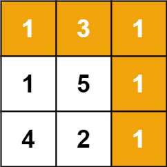

# 线性DP

## 斐波那契数列
斐波那契数 （通常用 F(n) 表示）形成的序列称为 斐波那契数列 。该数列由 0 和 1 开始，后面的每一项数字都是前面两项数字的和。也就是：

F(0) = 0，F(1) = 1
F(n) = F(n - 1) + F(n - 2)，其中 n > 1
给定 n ，请计算 F(n) 。

### 数组记忆集
- 用一个长为n+1的数组记录从fib(0)~fib(n)的结果,每次计算新的值时可以1用到数组中的计算结果
- 缺点: 每次只用到了最近的两个元素,存储所有元素会浪费存储空间
```java
class Solution {
    public int fib(int n) {
        if (n <= 1) {
            return n;
        }
        int[] fn = new int[n];
        fn[0] = 0;
        fn[1] = 1;
        for (int i = 2; i < n; i++) {
            fn[i] = fn[i - 1] + fn[i - 2];
        }
        return fn[n - 1] + fn[n - 2];
    }
}
```

### 变量迭代
- 使用a,b两个变量存储最近的两个斐波那契数,计算出新值时重新给a,b赋值,让其始终是最新的两个结果

```java
class Solution {
    public int fib(int n) {
        if (n <= 1) {
            return n;
        }

        int a=0;
        int b=1;
        for(int i=2;i<=n;i++){
            int tmp=b;
            b=a+b;
            a=tmp;
        }
        return b;
    }
}
```

## 爬楼梯

假设你正在爬楼梯。需要 n 阶你才能到达楼顶。

每次你可以爬 1 或 2 个台阶。你有多少种不同的方法可以爬到楼顶呢？

### 思路

- 总共n级阶梯
- F(n)表示第n级楼梯可能的方法数,则F(n)=F(n-1)+F(n-2),且F(1)=1,F(2)=2
这个问题可以抽象成斐波那契数列问题
```java
class Solution {
    public int climbStairs(int n) {
        if (n <= 2) {
            return n;
        }

        int a=1;
        int b=2;
        for(int i=3;i<=n;i++){
            int tmp=b;
            b=a+b;
            a=tmp;
        }
        return b;
    }
}
```

## 最小花费爬楼梯

## 最大子数组和

## 打家劫舍

你是一个专业的小偷，计划偷窃沿街的房屋。每间房内都藏有一定的现金，影响你偷窃的唯一制约因素就是相邻的房屋装有相互连通的防盗系统，如果两间相邻的房屋在同一晚上被小偷闯入，系统会自动报警。

给定一个代表每个房屋存放金额的非负整数数组，计算你 不触动警报装置的情况下 ，一夜之内能够偷窃到的最高金额。

### 思路

- 抢劫[0..i]房屋获得最大金额,有以下两种情况
    - 要么是抢劫[0..i-1]获得最大金额不抢劫i坐标的房屋
    - 要么是抢劫[0..i-2]获得最大金额同时抢劫i坐标的房屋

- dp[i] = Max(dp[i-1],dp[i-2]+nums[i])

```java
class Solution {
    public int rob(int[] nums) {
        if(nums.length==1){
            return nums[0];
        }
        //max(i)=max(max(i-1),max(i-2)+nums[i])
        int[] dp=new int[nums.length];
        dp[0]=nums[0];
        dp[1]=Math.max(dp[0],nums[1]);
        for(int i=2;i<nums.length;i++){
            dp[i]=Math.max(dp[i-1],dp[i-2]+nums[i]);
        }

        return dp[nums.length-1];
    }
}
```
**简化写法**

```java
class Solution {
    public int rob(int[] nums) {
        if(nums.length==1){
            return nums[0];
        }
        //max(i)=max(max(i-1),max(i-2)+nums[i])
        int first=nums[0];
        int second=Math.max(first,nums[1]);
        for(int i=2;i<nums.length;i++){
            int tmp=second;
            second=Math.max(second,first+nums[i]);
            first=tmp;
        }

        return second;
    }
}
```


## 打家劫舍二

你是一个专业的小偷，计划偷窃沿街的房屋，每间房内都藏有一定的现金。这个地方所有的房屋都 围成一圈 ，这意味着第一个房屋和最后一个房屋是紧挨着的。同时，相邻的房屋装有相互连通的防盗系统，如果两间相邻的房屋在同一晚上被小偷闯入，系统会自动报警 。

给定一个代表每个房屋存放金额的非负整数数组，计算你 在不触动警报装置的情况下 ，今晚能够偷窃到的最高金额。

### 思路

- 在打家劫舍一的基础上不能同时偷0号住户和n-1号住户
    - 不偷0号住户 得到Max1
    - 不偷n-1号住户 得到Max2
- Max=Max(Max1,Max2)

```java
class Solution {
    public int rob(int[] nums) {
        int n=nums.length;
        if(n==1){
            return nums[0];
        }

        if(n==2){
            return Math.max(nums[0],nums[1]);
        }
        //1.不偷0坐标住户
        //2.不偷n-1坐标住户
        //返回1 2中较大的
        return Math.max(rob(nums,1,n-1),rob(nums,0,n-2));
    }

    public int rob(int[] nums,int start,int end){
        int first=nums[start];
        int second=Math.max(first,nums[start+1]);
        for(int i=start+2;i<=end;i++){
            int tmp=second;
            second=Math.max(second,first+nums[i]);
            first=tmp;
        }
        return second;
    }
}
```

## 打家劫舍三


# 路径问题(二维网格)

## 最小路径和



给定一个包含非负整数的 m x n 网格 grid ，请找出一条从左上角到右下角的路径，使得路径上的数字总和为最小。

说明：一个机器人每次只能向下或者向右移动一步。

```java
class Solution {
    public int minPathSum(int[][] grid) {
        //dp[i][j] = Min(dp[i-1][j],dp[i][j-1]) +grid[i][j];
        //特殊情况 
        //第0行只能由其左边的位置移动而来
        //第0列只能由其上边的位置移动而来

        int m=grid.length;
        int n=grid[0].length;
        int[][] dp=new int[m][n];
        dp[0][0]=grid[0][0];
        for(int i=0;i<m;i++){
            for(int j=0;j<n;j++){
                if(i-1>=0&&j-1>=0){
                    dp[i][j]=Math.min(dp[i][j-1],dp[i-1][j])+grid[i][j];
                }else if(i-1>=0){
                    dp[i][j]=dp[i-1][j]+grid[i][j];
                }else if(j-1>=0){
                    dp[i][j]=dp[i][j-1]+grid[i][j];
                }
            }
        }
        return dp[m-1][n-1];
    }
}
```

## 不同路径

## 不同路径二

## 三角形最小路径和

## 下降路径最小和