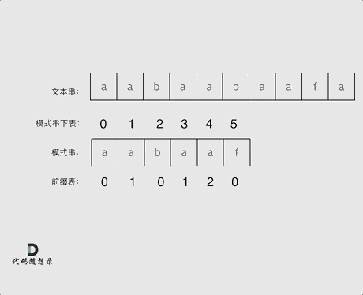
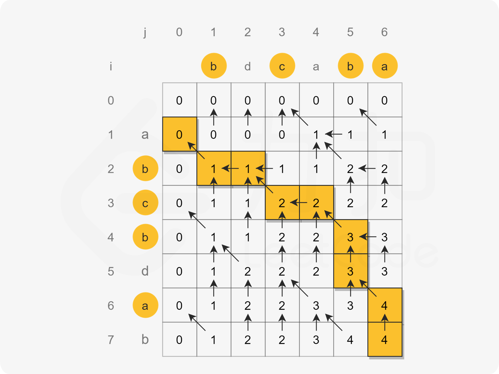

# 最长不重复子串
```java
class Solution {
    public int lengthOfLongestSubstring(String s) {
        if (s == null || s.length() == 0) {
            return 0;
        }

        LinkedHashSet<Character> set = new LinkedHashSet<>();
        int l =0 ;
        int r =0;
        int maxLen=0;
        while(l<=r&&r<s.length()){
            if(set.contains(s.charAt(r))){
                set.removeFirst();
                l++;
            }else {
                set.addLast(s.charAt(r));
                maxLen=Math.max(maxLen,r-l+1);
                r++;
            }
        }

        return maxLen;
    }

}
```
# 最长回文串
```java
class Solution {
    public String longestPalindrome(String s) {
        int start=0;
        int end=0;
        int maxLen=1;
        for(int i=0;i<s.length();i++){
            //单数
            // i-1 i i+1
            int l=i-1;
            int r=i+1;
            while(l>=0&&r<s.length()&&s.charAt(l)==s.charAt(r)){
                if(r-l+1>maxLen){
                    start=l;
                    end=r;
                    maxLen=r-l+1;
                }
                l--;
                r++;
            }

            //双数 i-2 i-1 i i+1
            l=i-1;
            r=i;
            while(l>=0&&r<s.length()&&s.charAt(l)==s.charAt(r)){
                if(r-l+1>maxLen){
                    start=l;
                    end=r;
                    maxLen=r-l+1;
                }
                l--;
                r++;
            }
        }
        return s.substring(start,end+1);
    }

}
```

# 字符串匹配

## 原理

- next数组: 将待匹配字符串的子串[0,i]的最长公共前后缀都求解出来作为,不匹配时跳转的数组
- 主串和匹配串不相等时即S[i]!=P[j]时,主串不动,匹配串跳转到上一个字符的前缀末尾+1的位置即j=next[j-1]继续匹配
- 时间复杂度O(m+n)



```java
class Solution {
    public int strStr(String haystack, String needle) {
        if(haystack.length()<needle.length()){
            return -1;
        }

        // next[i] 的值代表 [0...i] 区间的最长公共前后缀长度
        // 同时也是下一个待匹配的前缀字符下标
        // i 代表后缀末尾
        // j 代表下一个待匹配的前缀字符下标，其值等于已匹配的最长公共前后缀长度
        // 如果 s[i]==s[j]，匹配延长，j++，next[i]=j（此时 j 为原来的 j+1）
        // 如果 s[i]!=s[j]，j 回退到 next[j-1] 继续匹配
        // next[j-1] 是 [0...j-1] 的最长公共前后缀长度，也是 [0...j-1] 的下一个待匹配字符下标
        int[] next = new int[needle.length()];
        next[0]=0;
        for(int i=1,j=0;i<needle.length();i++){
            while(j>0&&needle.charAt(i)!=needle.charAt(j)){
                j=next[j-1];
            }

            if(needle.charAt(i)==needle.charAt(j)){
                j++;
            }
            next[i]=j;
        }

        for(int i=0,j=0;i<haystack.length();i++){
            while(j>0&&haystack.charAt(i)!=needle.charAt(j)){
                j=next[j-1];
            }

            if(haystack.charAt(i)==needle.charAt(j)){
                j++;
            }

            if(j==needle.length()){
                return i-needle.length()+1;
            }
        }

        return -1;
    }
}
```


# 最长公共前缀
```java
class Solution {
    public String longestCommonPrefix(String[] strs) {
        //prefix[i]=getPrefix(prefix[i-1],strs[i])
        String prefix=strs[0];
        for(int i=1;i<strs.length;i++){
            prefix=getPrefix(prefix,strs[i]);
        }
        return prefix;
    }

    String getPrefix(String str1,String str2){
        StringBuilder prefix=new StringBuilder();
        int i=0;
        while(i<str1.length()&&i<str2.length()){
            if(str1.charAt(i)==str2.charAt(i)){
                prefix.append(str1.charAt(i));
                i++;
            }else{
                break;
            }
        }
        return prefix.toString();
    }
}
```

# 最长公共子序列

给定两个字符串 text1 和 text2，返回这两个字符串的最长 公共子序列 的长度。如果不存在 公共子序列 ，返回 0 。
一个字符串的 子序列 是指这样一个新的字符串：它是由原字符串在不改变字符的相对顺序的情况下删除某些字符（也可以不删除任何字符）后组成的新字符串。

例如，"ace" 是 "abcde" 的子序列，但 "aec" 不是 "abcde" 的子序列。
两个字符串的 公共子序列 是这两个字符串所共同拥有的子序列。

## 思路
- dp[i][j] 代表text1[0..i-1]与text2[0..j-1]的最长公共子序列长度
- text1[i-1]==text2[j-1]=>dp[i][j] = dp[i-1][j-1]
- text1[i-1]!=text2[j-1]=>dp[i][j] = Max(dp[i-1][j],dp[i][j-1])
- 最长子序列就是每次相等的时候的字符集合



```java
class Solution {
    public int longestCommonSubsequence(String text1, String text2) {
        //以text1长度+1为行text2长度+1为列构建二维数组
        //dp[i][j] 代表text1[0..i-1]与text2[0..j-1]的最长公共子序列长度
        
        //如果text1[i-1]==text2[j-1] dp[i][j]=dp[i-1][j-1]+1
        //含义: 如果当前两个字符相等,可以将其加入最长公共子序列元素中,两个字符串下标都向后移动一位
        //序列状态 text1[0..i-2],text2[0..j-2] -> text1[0..i-1] text[0..j-1]
        //
        //如果text1[i-1]!=text2[j-1] dp[i][j]=max(dp[i-1][j],dp[i][j-1])
        //含义: 如果当前两个字符不相等 计算剔除其中一个字符与另外一个包含当前字符的最长子序列长度 取最大值
        //序列状态  text1[0..i-2],text2[0..j-1] -> text1[0..i-1] text[0..j-1]
        //或       text1[0..i-1],text2[0..j-2] -> text1[0..i-1] text[0..j-1]

        //text1[i-1]==text2[j-1]=>dp[i][j] = dp[i-1][j-1]
        //text1[i-1]!=text2[j-1]=>dp[i][j] = Max(dp[i-1][j],dp[i][j-1])
        int m=text1.length()+1;
        int n=text2.length()+1;
        int[][] dp=new int[m][n];
        for(int i=1;i<m;i++){
            for(int j=1;j<n;j++){
                if(text1.charAt(i-1)==text2.charAt(j-1)){
                    dp[i][j]=dp[i-1][j-1]+1;
                }else{
                    dp[i][j]=Math.max(dp[i-1][j],dp[i][j-1]);
                }
            }
        }
        return dp[m-1][n-1];
    }
}
```

# 前缀树
