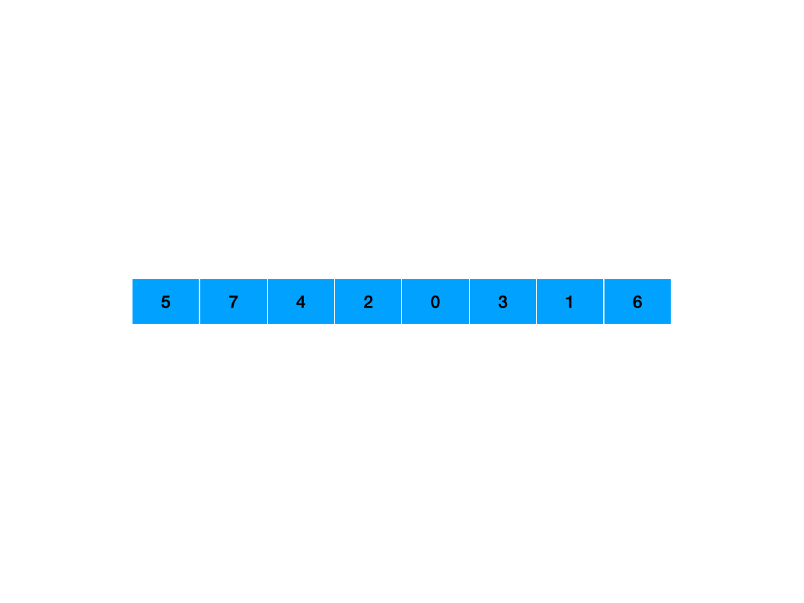
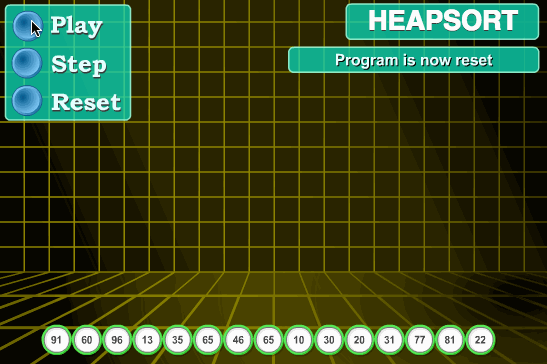

# 归并排序

## 原理

先递归拆分,直到子数组中只有一个元素,然后再将子数组两两合并为更大的数组直到所有子数组都被合并。
- sort : sort函数用来将元素个数大于1的子数组[l,r]均分成两个子数组[l,mid],[mid+1,r],对子数组递归调用sort继续拆分
- merge : merge 用于将两个相邻的有序子数组[l,mid],[mid+1,r]合并为一个更大的有序数组[l,r]


### 实现

- 全局数组: 使用一个和nums长度相同的全局数组,每次合并两个相邻有序数组[l,mid],[mid+1,r]前将两个子数组的元素放入aux全局数组的[l,r]位置,防止合并过程中nums的元素混乱,aux只用作比较和赋值,合并过程中不会被修改
- 局部数组: 每次merge入口处使用一个长度为r-l+1的数组将[l,mid],[mid+1,r]放入aux的[0,r-l]位置,合并过程中用aux[x-l]取得nums[x]的原始位置元素

## 全局数组

```java
class Solution {
    public int[] sortArray(int[] nums){
        new SortObj(nums.length).sort(nums,0,nums.length-1);
        return nums;
    }

    static class SortObj{
        int[] aux;
        SortObj(int n){
            aux=new int[n];
        }

        public void sort(int[]nums,int l,int r){
            if(l>=r){
                return;
            }
            int mid=(l+r)/2;
            sort(nums,l,mid);
            sort(nums,mid+1,r);
            merge(nums,l,mid,r);
        }

        public void merge(int[]nums,int l ,int mid,int r){
            for (int k = l; k <= r; k++) {
                aux[k]=nums[k];
            }

            int i=l;
            int j=mid+1;
            int k=l;
            while(i<=mid||j<=r){
                if(i<=mid&&j<=r){
                    if(aux[i]<=aux[j]){
                        nums[k++]=aux[i++];
                    }else {
                        nums[k++]=aux[j++];
                    }
                } else if (i<=mid) {
                    nums[k++]=aux[i++];
                }else {
                    nums[k++]=aux[j++];
                }
            }
        }
    }
}
```

## 局部数组

```java
class Solution {
    public int[] sortArray(int[] nums) {
        sort(nums, 0, nums.length - 1);
        return nums;
    }

    void sort(int[] nums, int l, int r) {
        if (l >= r) {
            return;
        }

        int mid = (l + r) / 2;
        sort(nums, l, mid);
        sort(nums, mid+1, r);
        merge(nums, l, mid, r);
    }

    void merge(int[] nums, int l, int mid, int r) {
        int[] aux = new int[r - l + 1];
        for (int i = 0; i < aux.length; i++) {
            aux[i] = nums[l + i];
        }

        int i = l;
        int j = mid+1;
        int k = l;
        while (i <= mid || j <= r) {
            if (i <= mid && j <= r) {
                if (aux[i - l] <= aux[j - l]) {
                    nums[k] = aux[i - l];
                    i++;
                    k++;
                } else {
                    nums[k] = aux[j - l];
                    j++;
                    k++;
                }
            } else if (i <= mid) {
                nums[k] = aux[i - l];
                i++;
                k++;
            } else {
                nums[k] = aux[j - l];
                j++;
                k++;
            }
        }
    }

    void swap(int[] nums, int i1, int i2) {
        int tmp = nums[i1];
        nums[i1] = nums[i2];
        nums[i2] = tmp;
    }
}
```

# 快速排序

## 原理

先取一个基准值,使用右指针从右往左遍历找到第一个不大于基准值的数,左指针从左到右遍历找到第一个不小于基准值的数,如果没有碰撞就交换二者的位置,直到二者碰撞然后交换基准值和右指针的位置,此时基准值左边都小于等于它,右边都大于等于它,再将递归基准值左右两边都子数组进行这一过程直到子数组元素个数为1为止
- partition: 分区函数,用来将子数组划分成左右两个分区,并返回基准值
- sort: 递归左右分区,直到子数组元素个数为1


## 实现

- 等于基准值时也交换
    - 假设数组为 [3, 3, 3, 3, 3]，基准值为 3：如果不交换：左指针会一直向右走，直到数组末尾。
    - 这会导致分区结果一边是 0 个元素，另一边是 n-1 个元素。
    - 结果：即使数组是随机的，如果其中包含大量重复值，快速排序会退化到 O(n^2)。
    - 如果交换：左右指针都会在遇到 3 时停止并进行交换。虽然这看起来做了“无用功”，但它强制让左右指针在中间汇合。
    - 结果：数组被近乎完美地平分为两半，保持 O(nlogn)的效率。
- 最左位置作为基准值
    - 如果输入的数组已经是有序的（或基本有序），最左基准值必然是当前区间的最小值。
    - 分区后，一边为空，另一边包含 n-1 个元素。
    - 结果：递归树变成了一个细长的链表，时间复杂度直接退化为 O(n^2)。这在处理实际业务数据（往往带有局部有序性）时非常危险。
- 随机位置作为基准值
    - 打破最坏情况：无论输入数组是否有序、逆序或局部有序，随机选择都能大概率选中一个接近“中位数”的数字。
    - 数学期望稳定：其平均时间复杂度严格保证在 O(nlogn)，且极难被构造出的特定数据（Killer Inserts）攻击。

## 最左基准值
```java
class Solution {
    public int[] sortArray(int[] nums){
        sort(nums,0,nums.length-1);
        return nums;
    }

    void sort(int[] nums,int l,int r){
        if(l>=r){
            return ;
        }
        int pivot=partition(nums,l,r);
        sort(nums,l,pivot-1);
        sort(nums,pivot+1,r);
    }

    int partition(int[]nums,int l ,int r){
        int pivotIndex=l;
        int pivotValue=nums[pivotIndex];
        l++;

        while(true){
            while(l<=r&&nums[r]>pivotValue){
                r--;
            }
            while(l<=r&&nums[l]<pivotValue){
                l++;
            }

            if(l>r){
                break;
            }
            swap(nums,l,r);
            r--;
            l++;
        }
        swap(nums,pivotIndex,r);
        return r;
    }

    void swap(int[] nums,int i1,int i2){
        int tmp=nums[i1];
        nums[i1]=nums[i2];
        nums[i2]=tmp;
    }
}
```
## 随机基准值
```java
class Solution {
    Random random = new Random();
    public int[] sortArray(int[] nums){
        sort(nums,0,nums.length-1);
        return nums;
    }

    void sort(int[] nums,int l,int r){
        if(l>=r){
            return ;
        }
        int pivot=partition(nums,l,r);
        sort(nums,l,pivot-1);
        sort(nums,pivot+1,r);
    }

    int partition(int[]nums,int l ,int r){
        int pivotIndex=l+random.nextInt(r-l+1);
        int pivotValue=nums[pivotIndex];
        //把pivot放到l的位置
        swap(nums,l,pivotIndex);
        pivotIndex=l;
        l++;

        while(true){
            while(l<=r&&nums[r]>pivotValue){
                r--;
            }
            while(l<=r&&nums[l]<pivotValue){
                l++;
            }

            if(l>r){
                break;
            }
            swap(nums,l,r);
            r--;
            l++;
        }
        swap(nums,pivotIndex,r);
        return r;
    }

    void swap(int[] nums,int i1,int i2){
        int tmp=nums[i1];
        nums[i1]=nums[i2];
        nums[i2]=tmp;
    }
}
```

# 堆排序

## 原理


### 堆性质

在排序算法中，堆通常是指一种完全二叉树，并满足以下性质：
- 大顶堆（Max Heap）：父节点的值总是 >= 左右子节点的值。堆顶（根节点）就是最大值。
- 小顶堆（Min Heap）：父节点的值总是 <= 左右子节点的值。堆顶就是最小值。
注意： 在内存中，我们通常不需要真的去建立一棵树，而是用数组来表示堆。对于下标为 i 的节点：
- 左孩子下标：2i + 1
- 右孩子下标：2i + 2
- 父节点下标：(i - 1) / 2

### 建堆
将一个无序数组调整为一个大顶堆的过程如下:
- 从最后一个非叶子节点开始（下标为 n/2 - 1），向上遍历每个节点。
- 对每个节点执行“下沉（Sift Down）”操作：比较该节点与其左右子节点，如果子节点更大，则交换，直到该节点不再比子节点小或者到达叶子位置。
- 建立堆的时间复杂度是 O(n)

### 排序(循环取顶)

- 交换：将堆顶元素（最大值）与数组当前的最后一个元素交换。此时，最大值已经回到了它最终应在的位置。
- 缩小范围：将剩下的 n-1 个元素重新看作一个堆（排除掉已经排好序的末尾元素）。
- 调整：因为刚才的交换破坏了大顶堆性质，再次对堆顶执行“下沉”操作，使其重新成为大顶堆。重复：重复上述过程，直到堆的大小变为 1。(调整的时间复杂度是O(logn))
- 循环取顶的时间复杂度是O(nlohn)

## 实现
- heapfy: 在只有堆顶不符合堆定义的情况下,将堆顶元素下沉到指定位置,让所有元素符合堆定义
- sort: 从最后一个根节点开始构建堆,然后从最后一个元素开始遍历,将堆顶元素和末尾元素交换,然后缩小范围维护剩下元素,重复此操作,直到所有元素都被取完。

### 大根堆

```java
class Solution {
    public int[] sortArray(int[] nums){
        //建堆
        for(int i=nums.length/2-1;i>=0;i--){
            heapfy(nums,nums.length,i);
        }

        //循环取顶 与末尾元素交换 然后维护剩下元素
        for(int i=nums.length-1;i>=0;i--){
            swap(nums,0,i);
            heapfy(nums,i,0);
        }
        return nums;
    }

    /**
     * 当堆顶不符合堆定义 且子树都符合堆定义时
     * 通过此方法让堆顶元素下沉到所有元素都符合堆定义的位置
     * 方法执行完[i,n-1]是一个最大堆 堆顶是i
     */
    void heapfy(int[]nums,int n,int i){
        int largest=i;
        int left=2*i+1;
        int right=2*i+2;

        if(left<n&&nums[largest]<nums[left]){
            largest=left;
        }

        if(right<n&&nums[largest]<nums[right]){
            largest=right;
        }

        if(largest!=i){
            swap(nums,largest,i);
            heapfy(nums,n,largest);
        }
    }

    void swap(int[] nums,int i1,int i2){
        int tmp=nums[i1];
        nums[i1]=nums[i2];
        nums[i2]=tmp;
    }
}
```


