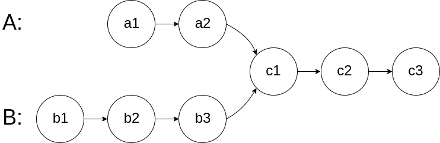

# 链表反转
```java
class Solution {
    public ListNode reverseList(ListNode head) {
        ListNode pre = null;
        ListNode cur = head;
        while(cur!=null){
            ListNode tmp=cur.next;
            cur.next=pre;
            pre=cur;
            cur=tmp;
        }
        return pre;
    }
}
```
# 链表k个一组反转
```java
class Solution {
    ListNode reverse(ListNode root){
       ListNode pre = null;
       ListNode cur=root;
       while(cur!=null){
        ListNode tmp=cur.next;
        cur.next=pre;
        pre=cur;
        cur=tmp;
       }
       return pre;
    }
    
    public ListNode reverseKGroup(ListNode head, int k) {
        ListNode dummy=new ListNode(-1);
        dummy.next=head;
        ListNode pre=dummy;
        ListNode start=head;
        ListNode end=head;
        int count=1;
        while(end!=null){
            if(count==k){
                //记录next
                ListNode next=end.next;
                //断开尾节点
                end.next=null;
                //反转 返回首节点
                pre.next=reverse(start);
                //重置pre start end
                pre=start;//start现在为上一段的尾部节点
                start=next;
                //前驱next指向新的首节点
                pre.next=start;
                end=next;
                count=1;
            }else{
                count++;
                end=end.next;
            }
        }
        return dummy.next;
    }
}
```

# 合并有序链表
```java
class Solution {
    public ListNode mergeTwoLists(ListNode list1, ListNode list2) {
        ListNode dummy = new ListNode(-1);
        ListNode cur=dummy;
        while(list1!=null||list2!=null){
            if(list1!=null&&list2!=null){
                if(list1.val<list2.val){
                    cur.next=list1;
                    cur=cur.next;
                    list1=list1.next;
                }else{
                    cur.next=list2;
                    cur=cur.next;
                    list2=list2.next;
                }
            }else if(list1!=null){
                cur.next=list1;
                break;
            }else{
                cur.next=list2;
                break;
            }
        }

        return dummy.next;
    }
}
```
# 合并k个有序链表

- 合并k个升序列表=>从第一个链表开始往后迭代和并

```java
/**
 * Definition for singly-linked list.
 * public class ListNode {
 *     int val;
 *     ListNode next;
 *     ListNode() {}
 *     ListNode(int val) { this.val = val; }
 *     ListNode(int val, ListNode next) { this.val = val; this.next = next; }
 * }
 */
class Solution {

    public ListNode mergeList(ListNode l1,ListNode l2){
        ListNode dummy=new ListNode();
        ListNode cur=dummy;
        while(l1!=null||l2!=null){
            if(l1!=null&&l2!=null){
                if(l1.val<=l2.val){
                    cur.next=l1;
                    cur=cur.next;
                    l1=l1.next;
                }else {
                    cur.next=l2;
                    cur=cur.next;
                    l2=l2.next;
                }
            }else if(l1!=null){
                cur.next=l1;
                break;
            }else {
                cur.next=l2;
                break;
            }
        }

        return dummy.next;
    }
    public ListNode mergeKLists(ListNode[] lists) {
        if(lists.length==0){
            return null;
        }

        if(lists.length==1){
            return lists[0];
        }
        //合并k个升序列表=>从第一个链表开始往后迭代和并
        for(int i=1;i<lists.length;i++){
            lists[i]=mergeList(lists[i-1],lists[i]);
        }
        return lists[lists.length-1];
    }
}
```

# 删除指定节点

有一个单链表的 head，我们想删除它其中的一个节点 node。

给你一个需要删除的节点 node 。你将 无法访问 第一个节点  head。

链表的所有值都是 唯一的，并且保证给定的节点 node 不是链表中的最后一个节点。

删除给定的节点。注意，删除节点并不是指从内存中删除它。这里的意思是：

给定节点的值不应该存在于链表中。
链表中的节点数应该减少 1。
node 前面的所有值顺序相同。
node 后面的所有值顺序相同。

```java
class Solution {
    public void deleteNode(ListNode node) {
        int nextValue=node.next.val;
        node.val=nextValue;
        //删除下一个节点
        node.next=node.next.next;
    }
}
```

# 删除链表指定值的节点

```java
/**
 * Definition for singly-linked list.
 * public class ListNode {
 *     int val;
 *     ListNode next;
 *     ListNode() {}
 *     ListNode(int val) { this.val = val; }
 *     ListNode(int val, ListNode next) { this.val = val; this.next = next; }
 * }
 */
class Solution {
    public ListNode deleteNode(ListNode head, int val) {
        ListNode dummy=new ListNode();
        dummy.next=head;
        ListNode pre=dummy;
        ListNode cur=head;
        while(cur!=null){
            if(cur.val==val){
                pre.next=cur.next;
                break;
            }
            pre=cur;
            cur=cur.next;
        }
        return dummy.next;
    }
}
```

# 删除链表倒数第n个节点
```java
class Solution {
    public ListNode removeNthFromEnd(ListNode head, int n) {
        ListNode dummy = new ListNode();
        dummy.next = head;
        ListNode fast = dummy;
        ListNode slow = dummy;
        int count = 0;
        //fast先走n步
        while (fast != null&&count!=n) {
            fast = fast.next;
            count++;
        }
        //此时slow在dummy处 fast在第n个节点处
        //以fast为倒数第一个节点则slow的下一个节点是倒数第n个节点
        //slow和fast一起走 直到fast在最后一个节点
        while (fast.next != null) {
            fast = fast.next;
            slow = slow.next;
        }
        //删除slow的下一个节点
        slow.next= slow.next.next;
        return dummy.next;
    }
}
```

# 获取链表中间节点

给你单链表的头结点 head ，请你找出并返回链表的中间结点。

如果有两个中间结点，则返回第二个中间结点。

## 思路

- 创建快慢两个指针 slow和fast,指向head前驱虚节点
- 每次fast走两步,slow走一步
- 把节点位置标号为从1到n则走完k次之后fast=2k slow=k

- 结束条件有以下两种情况
    - n为偶数
        - fast.next==null 走了n/2次
        - slow在n/2处 返回下一个节点
    - n为奇数
        - fast=null 走了n/2+1 次
        - slow在n/2+1处 返回当前节点

```java
class Solution {
    public ListNode middleNode(ListNode head) {
        ListNode dummy=new ListNode();
        dummy.next=head;
        ListNode slow=dummy;
        ListNode fast=dummy;
        while(fast!=null&&fast.next!=null){
            slow=slow.next;
            fast=fast.next.next;
        }
        return fast==null?slow:slow.next;
    }
}
```

# 相交链表

给你两个单链表的头节点 headA 和 headB ，请你找出并返回两个单链表相交的起始节点。如果两个链表不存在相交节点，返回 null 。

图示两个链表在节点 c1 开始相交：



题目数据 保证 整个链式结构中不存在环。

注意，函数返回结果后，链表必须 保持其原始结构 。

## 思路

- 使用pA和pB分别从headA与headB开始遍历两个链表
- 如果某个链表遍历完了,让其指向另一个链表头部继续遍历
- 假设链表相交,相交部分为C,不相交部分分别为A1和B1
    - A=A1+C B=B1+1
    - 遍历到交点时 pA路径为 A1+C+B1
    - 遍历到交点时 pB路径   B1+C+A1
- 如果链表不相交,二者会同时遍历到尾部
    - 两个链表一样长,同时遍历到各自的尾部,不相交
    - 两个链表不一样长: pA路径为A+B pB路径为B+A,二者同时遍历完

```java
public class Solution {
    public ListNode getIntersectionNode(ListNode headA, ListNode headB) {
        ListNode pA = headA;
        ListNode pB = headB;

        while (pA != null || pB != null) {
            if (pA == pB) {
                return pA;
            }
            pA = pA == null ? headB : pA.next;
            pB = pB == null ? headA : pB.next;
        }
        return null;
    }
```
# 链表是否成环

给你一个链表的头节点 head ，判断链表中是否有环。

如果链表中有某个节点，可以通过连续跟踪 next 指针再次到达，则链表中存在环。 为了表示给定链表中的环，评测系统内部使用整数 pos 来表示链表尾连接到链表中的位置（索引从 0 开始）。注意：pos 不作为参数进行传递 。仅仅是为了标识链表的实际情况。

如果链表中存在环 ，则返回 true 。 否则，返回 false 。


## 思路

- 使用fast和slow两个指针分别从头遍历链表,fast每次走两步,slow每次走一步
- 如果链表成环fast一定会在环内追上slow
- 如果链表不成环,fast先走到末尾

```java
public class Solution {
    public boolean hasCycle(ListNode head) {
       ListNode fast=head;
       ListNode slow=head;
       while(fast!=null&&fast.next!=null){
         fast=fast.next.next;
         slow=slow.next;
         if(fast==slow){
            return true;
         }
       }
       return false;
    }
}
```

# 两两交换链表节点

# 链表相加

给你两个 非空 的链表，表示两个非负的整数。它们每位数字都是按照 逆序 的方式存储的，并且每个节点只能存储 一位 数字。

请你将两个数相加，并以相同形式返回一个表示和的链表。

你可以假设除了数字 0 之外，这两个数都不会以 0 开头。

## 思路

- 新建一个链表用来存储结果
- 两个链表左端对齐,同时遍历两个链表
    - 如果两个指针都不为空,新node的值为(v1+v2+odd)%10,odd=(v1+v2+odd)/10
    - 如果l1不为空,新node的值为(v1+odd)%10,odd=(v1+odd)/10
    - 如果l2不为空,新node的值为(v2+odd)%10,odd=(v2+odd)/10
    - 如果l1和l2都为空但是odd不为0,说明两个链表都遍历完了,但是存在进位,新node的值为odd,将odd=0

```java
class Solution {
    public ListNode addTwoNumbers(ListNode l1, ListNode l2) {
        ListNode dummy = new ListNode();
        ListNode cur = dummy;
        int odd = 0;
        while (l1 != null || l2 != null || odd != 0) {
            if (l1 != null && l2 != null) {
                int sum = l1.val + l2.val + odd;
                int val = sum % 10;
                odd = sum / 10;
                ListNode node = new ListNode(val);
                cur.next = node;
                cur = cur.next;
                l1 = l1.next;
                l2 = l2.next;
            } else if (l1 != null) {
                int sum = l1.val + odd;
                int val = sum % 10;
                odd = sum / 10;
                ListNode node = new ListNode(val);
                cur.next = node;
                cur = cur.next;
                l1 = l1.next;
            } else if (l2 != null) {
                int sum = l2.val + odd;
                int val = sum % 10;
                odd = sum / 10;
                ListNode node = new ListNode(val);
                cur.next = node;
                cur = cur.next;
                l2 = l2.next;
            }else{
                ListNode node = new ListNode(odd);
                odd=0;
                cur.next = node;
            }
        }

        return dummy.next;
    }
}
```

# 跳表